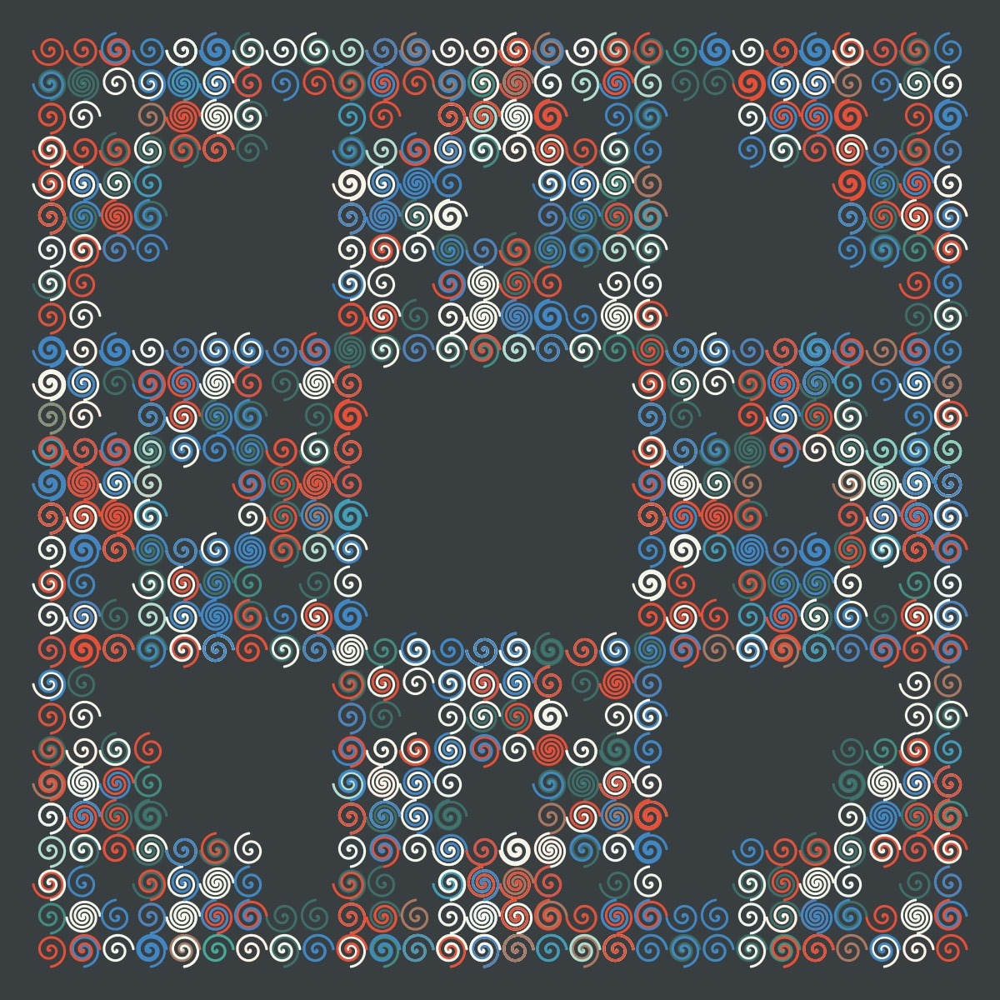

# L-Systems

From Wikipedia: "An L-system or Lindenmayer system is a parallel rewriting system and a type of formal grammar. An L-system consists of an alphabet of symbols that can be used to make strings, a collection of production rules that expand each symbol into some larger string of symbols, an initial "axiom" string from which to begin construction, and a mechanism for translating the generated strings into geometric structures."

- [Fractal Trees L-system Coding Challenge](https://thecodingtrain.com/challenges/16-l-system-fractal-trees)

- [Formulas for L-system by Paul Bourke](https://paulbourke.net/fractals/lsys/)

I have experimented with inserting different shapes into an L-system. It is hard to predict, in advance, whether a particular rule-set/shape combination is going to produce a nice design, but trial and error have resulted in some pretty cool ones. I started by experimenting with the Dragon rule-set after becoming interested in the dragon fractal because of Daniel Shiffman's latest Coding Challenge. (Add link!) One of my favorites is this image, which was created using the Dragon rule-set filled with the Astroid (level 10).

`s = new Astroid(0, 0, length * 0.5, 2);`

I also really like this version with the eight curve.

`s = new Eight(0, 0, length * 0.75);`

I also experimented added different spirals to the rule sets. This design was created by adding the archimedian spiral to the board rule set.

`s = new ArchimedesSpiral(0, 0, length * 0.4, -1, 0);`

And here is a design with the Cross rule-set filled with a lituus-spiral.

`let a = 0.5;`  
`let n = -0.5;`  
`let dir = -1;`  
`s = new Spiral(0, 0, dir, length, a, n, (PI * 10) / 8);`

Using the [supershape](https://thecodingtrain.com/challenges/23-2d-supershapes) expands the creative possibilities.  I used it in the Crystal rule-set with an alpha of 150 and different shades of blue since the shapes overlap.

`s = new Supershape(0, 0, length * 0.5,  2, 1, 0.7, 1.4, 0.5, 4);`

Here is another design using the Crystal rule-set, but now with the ceva shape.

`s = new Ceva(0, 0, length / 4);`

Changing the parameters in a curve can yield very different shapes, which lend themselves to different rule-sets. Here are two different designs using the kiss curve:

Snake Kolam rule-set with kiss curve

`s = new KissCurve(0, 0, length * 0.75, 1, 1);`

Hexgonal Gosper with kiss curve

`s = new KissCurve(0, 0, length * 0.3, 0.5, 5);`

Of course, one of the original applications for L-systems is creating realistic looking trees. I think adding a shape to the rule-set can improve the look of the trees.  For example, here is a tree using a regular line.

Tree with the supershape

`s = new Supershape(0, 0, length * 0.5,  2.5, 0.4, 1, 2, 1, 4);`

## 🌄 Gallery

<!-- IMAGE-LIST:START - Do not remove or modify this section -->
<!-- prettier-ignore-start -->
<!-- markdownlint-disable -->
<table>
  <tbody>
    <tr>
      <td align="center"><a href="">  <b> Dragon curve with astroid</b></a></td>
     <td align="center"><a href="">  <b> Mango leaf with astroid shape</b></a></td>
      <td align="center"><a href="">  <b> Peano curve filled with figure eight</b></a></td>
     <td align="center"><a href="">  <b> Pentaplexity filled with quadrifolium</b></a></td>
</tr>
<tr>
      <td align="center"><a href="">  <b> Tree with zigzag shape</b></a></td>
      <td align="center"><a href="">  <b> title</b></a></td>
      <td align="center"><a href="">  <b> title</b></a></td>
    <td align="center"><a href="">  <b> title</b></a></td>
  </tr>
    
 </tbody>
</table>

<!-- markdownlint-restore -->
<!-- prettier-ignore-end -->

<!-- IMAGE-LIST:END -->

Resources

- [L-system](https://en.wikipedia.org/wiki/L-system)
