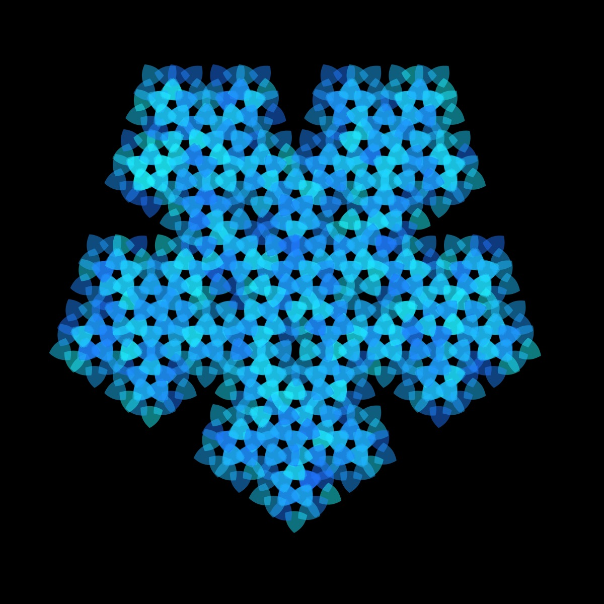

# L-System Generator with Shapes Instead of Lines

From Wikipedia:

> "An L-system or Lindenmayer system is a parallel rewriting system and a type of formal grammar. An L-system consists of an alphabet of symbols that can be used to make strings, a collection of production rules that expand each symbol into some larger string of symbols, an initial "axiom" string from which to begin construction, and a mechanism for translating the generated strings into geometric structures."

If you want to learn more about using L-systems to generate fractals, I highly recommend Daniel Shiffman's [Fractal Trees L-system Coding Challenge](https://thecodingtrain.com/challenges/16-l-system-fractal-trees). I have used the [L-system formulas by Paul Bourke](https://paulbourke.net/fractals/lsys/) to generate these designs. The rulesets can be found in the ruleset.json file. The code for the shapes is pulled from a couple of different sources: [The Coding Train](https://thecodingtrain.com), [Mathcurve.com](https://mathcurve.com), and [Wolfram Mathworld](https://mathworld.wolfram.com/topics/Curves.html)

I have experimented with inserting different shapes--including spirals, ovals, and even the supershape--into different L-system rule-sets. It is hard to predict, in advance, whether a particular rule-set/shape combination is going to produce a nice design, but trial and error have resulted in some pretty cool patterns. Here is a link to my [p5-sketch](https://editor.p5js.org/kfahn/sketches/B_P7q5oG_) if you would like to have fun yourself.

Daniel Shiffman recently recorded a Coding Challenge on the dragon fractal (coming soon), and my experiments started with the Dragon rule-set. One of my favorites is this image, which was created using the Dragon rule-set filled with the Astroid (level 10).

I also really like this version with the Archimedes spiral.

Since many of the shapes are a function of parameters that can be altered, I added some sliders to experiment with different rule-set/shape curve combinations and was able to generate some fun patterns. For example, I used the [supershape](https://thecodingtrain.com/challenges/23-2d-supershapes) in the crystal rule-set and the Krishna's anklet rule-set yielding very different patterns.

### Crystal rule-set

### Krishna's Anklet rule-set

Sometimes when you insert a shape into a rule-set, the result is quite different from the typical visualization. One example is inserting the cassini curve into the Hilbert rule-set. I am not sure that many people would look at this image and realize how it was generated.

Or this one generated with the pentaplexity ruleset and the cannibus curve.

## Fractal Trees

Of course, one of the original applications for L-systems is creating realistic looking trees. I think adding a shape to the rule-set can improve the look of the trees. For example, here is a tree rendered with the zig-zag curve.

## Palettes

I also want to give a shout-out to [supercolorpalette.com](https://supercolorpalette.com)!! I started out by creating a json file with palettes, but eventually found the supercolorpalette website. I was able to get the HEX codes from the url, and then create palette arrays very easily with some helper functions from chatGPT -- so much easier and faster than manually creating the palette arrays.

Here is a gallery with some examples of what you can create inserting shapes into L-system rule-sets. I also have additional images in the assets folder.

## 🌄 Gallery

<!-- IMAGE-LIST:START - Do not remove or modify this section -->
<!-- prettier-ignore-start -->
<!-- markdownlint-disable -->
<table>
  <tbody>
    <tr>
     <td align="center"><a href="">  <b> Krishna's Anklet rule-set with gear curve</b></a></td>
     <td align="center"><a href="">  <b> Mango leaf with astroid shape</b></a></td>
    </tr>
    <tr>
     <td align="center"><a href="">  <b> Krishna's anklet with quadrifolium curve</b></a></td>
     <td align="center"><a href="">  <b> Square skierpinski with lissajous curve</b></a></td>
</tr>
<tr>
      <td align="center"><a href="">  <b> Crystal rule-set with rose curve</b></a></td>
      <td align="center"><a href="">  <b> Crystal rule-set with ceva curve</b></a></td>
       </tr>
    <tr>
       <td align="center"><a href="">  <b> Snake kolam rule set with kiss curve</b></a></td>
       <td align="center"><a href="">  <b> Board rule-set with cross curve</b></a></td>
  </tr>
  <tr>
      <td align="center"><a href="">  <b> Koch snowflake rule-set with tear curve</b></a></td>
      <td align="center"><a href="">  <b> Koch rule-set with ceva curve</b></a></td>
       </tr>
    <tr>
       <td align="center"><a href="">  <b> Koch snowflake rule set with kiss curve</b></a></td>
    <td align="center"><a href="">  <b> Pentaplexity rule-set with supershape</b></a></td>
  </tr>
  
    
 </tbody>
</table>

<!-- markdownlint-restore -->
<!-- prettier-ignore-end -->

<!-- IMAGE-LIST:END -->

## References

- [L-system](https://en.wikipedia.org/wiki/L-system)
- [LSystemCreator](https://anuraghazra.dev/LSystemCreator/)
- [Principles of L-Systems](https://www.houdinikitchen.net/wp-content/uploads/2019/12/L-systems.pdf)
