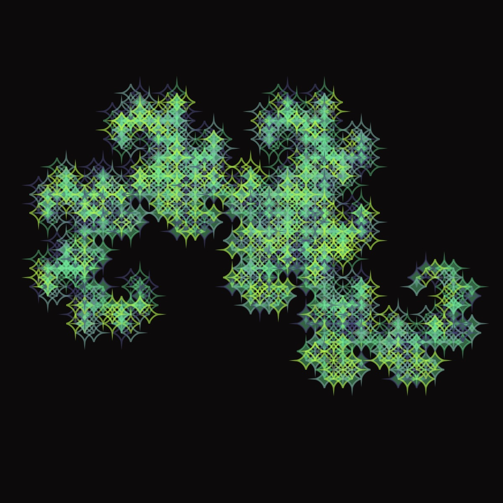

# L-Systems

Exploring L-systems with different shapes

Coding Train Challenge
Coding Train Logo interpreter

- [Formulas for L-system by Paul Bourke](https://paulbourke.net/fractals/lsys/)

- [L-system](https://github.com/kfahn22/Recursion/tree/main/L-system)

https://github.com/kfahn22/Apollonian-Gasket/edit/main/README.md

## 🌄 Gallery

<!-- IMAGE-LIST:START - Do not remove or modify this section -->
<!-- prettier-ignore-start -->
<!-- markdownlint-disable -->
<table>
  <tbody>
    <tr>
      <td align="center"><a href="">  <b> Dragon curve with astroid</b></a></td>
     <td align="center"><a href="">  <b> Mango leaf with astroid shape</b></a></td>
      <td align="center"><a href="">  <b> Peano curve filled with figure eight</b></a></td>
     <td align="center"><a href="">  <b> Pentaplexity filled with quadrifolium</b></a></td>
</tr>
<tr>
      <td align="center"><a href="">  <b> Tree with zigzag shape</b></a></td>
      <td align="center"><a href="">  <b> title</b></a></td>
      <td align="center"><a href="">  <b> title</b></a></td>
    <td align="center"><a href="">  <b> title</b></a></td>
  </tr>
    
 </tbody>
</table>

<!-- markdownlint-restore -->
<!-- prettier-ignore-end -->

<!-- IMAGE-LIST:END -->
