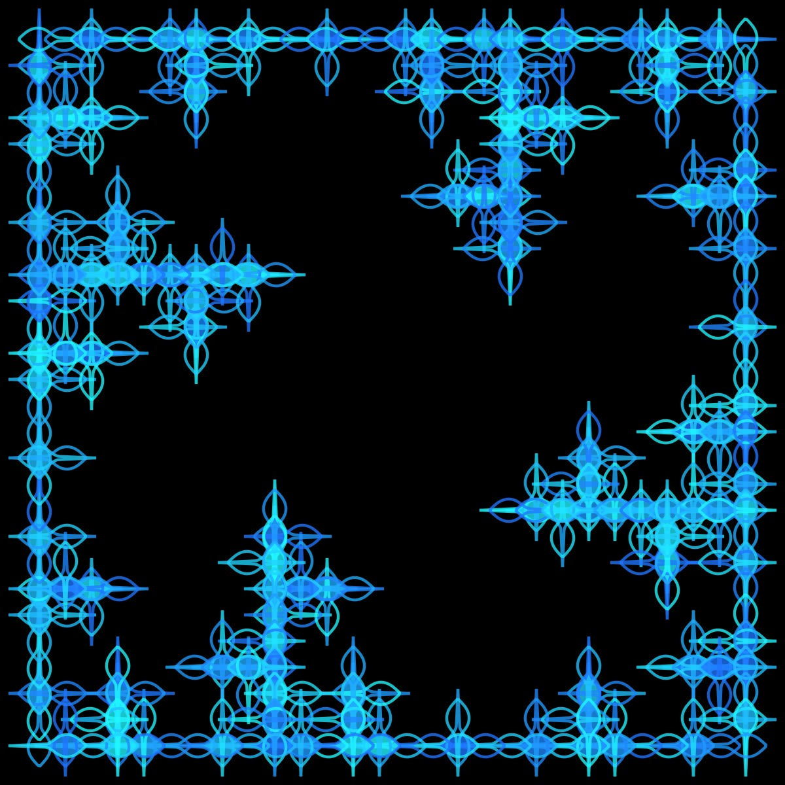

# L-System Generator with Shapes Instead of Lines

From Wikipedia:

 >"An L-system or Lindenmayer system is a parallel rewriting system and a type of formal grammar. An L-system consists of an alphabet of symbols that can be used to make strings, a collection of production rules that expand each symbol into some larger string of symbols, an initial "axiom" string from which to begin construction, and a mechanism for translating the generated strings into geometric structures."

- [Fractal Trees L-system Coding Challenge](https://thecodingtrain.com/challenges/16-l-system-fractal-trees)

I have used the [L-system formulas by Paul Bourke](https://paulbourke.net/fractals/lsys/) to generate these designs. The rulesets can be found in the ruleset.json file. The code for the shapes is pulled from a couple of different sources: [the Code Train](https://thecodingtrain.com), [Mathcurve.com](https://mathcurve.com), and [Wolfram Mathworld](https://mathworld.wolfram.com/topics/Curves.html)

I have experimented with inserting different shapes--including spirals, ovals, and even the supershape--into different L-system rule-sets. It is hard to predict, in advance, whether a particular rule-set/shape combination is going to produce a nice design, but trial and error have resulted in some pretty cool patterns.

[p5-sketch](https://editor.p5js.org/kfahn/sketches/B_P7q5oG_)

Daniel Shiffman recently did a Coding Challenge on the dragon fractal, and my experiments started with the Dragon rule-set. (Add link!) One of my favorites is this image, which was created using the Dragon rule-set filled with the Astroid (level 10).

I also really like this version with the Archimedes Spiral.

Using the [supershape](https://thecodingtrain.com/challenges/23-2d-supershapes) expands the creative possibilities. I used it in the Crystal rule-set with an alpha of 150 and different shades of blue since the shapes overlap.

I also added it to the Krishna's Anklet pattern.

Changing the parameters in a curve can yield very different shapes, which lend themselves to different rule-sets. Here are two different designs using the kiss curve:

Snake Kolam rule-set with overlapping kiss curves.

Sometimes when you insert a shape into a rule-set, the result is quite different from the typical representation. One example is inserting the Cassini oval into the Hilbert rule-set. I am not sure that many people would look at this image and realize how it was generated.

Or this one generated with the pentaplexity ruleset and the cannibus curve.

## Fractal Trees

Of course, one of the original applications for L-systems is creating realistic looking trees. I think adding a shape to the rule-set can improve the look of the trees. For example, here is a tree using a regular line.

## 🌄 Gallery

<!-- IMAGE-LIST:START - Do not remove or modify this section -->
<!-- prettier-ignore-start -->
<!-- markdownlint-disable -->
<table>
  <tbody>
    <tr>
      <td align="center"><a href="">  <b> Dragon curve with supershape</b></a></td>
     <td align="center"><a href="">  <b> Mango leaf with astroid shape</b></a></td>
      <td align="center"><a href="">  <b> Krishna's Anklet with the quadrifolium</b></a></td>
     <td align="center"><a href="">  <b> Pentaplexity filled with quadrifolium</b></a></td>
</tr>
<tr>
      <td align="center"><a href="">  <b> Dragon curve with supershape</b></a></td>
     <td align="center"><a href="">  <b> Mango leaf with astroid shape</b></a></td>
      <td align="center"><a href="">  <b> Krishna's Anklet with the quadrifolium</b></a></td>
     <td align="center"><a href="">  <b> Pentaplexity filled with quadrifolium</b></a></td>
</tr>
<tr>
      <td align="center"><a href="">  <b> Tree with zigzag shape</b></a></td>
      <td align="center"><a href="">  <b> title</b></a></td>
      <td align="center"><a href="">  <b> title</b></a></td>
    <td align="center"><a href="">  <b> title</b></a></td>
  </tr>
    
 </tbody>
</table>

<!-- markdownlint-restore -->
<!-- prettier-ignore-end -->

<!-- IMAGE-LIST:END -->

[Animated dragon curve](https://editor.p5js.org/kfahn/sketches/ePtGuXHE-)
Resources

## References

- [L-system](https://en.wikipedia.org/wiki/L-system)
- [LSystemCreator](https://anuraghazra.dev/LSystemCreator/)
- [Principles of L-Systems](https://www.houdinikitchen.net/wp-content/uploads/2019/12/L-systems.pdf)