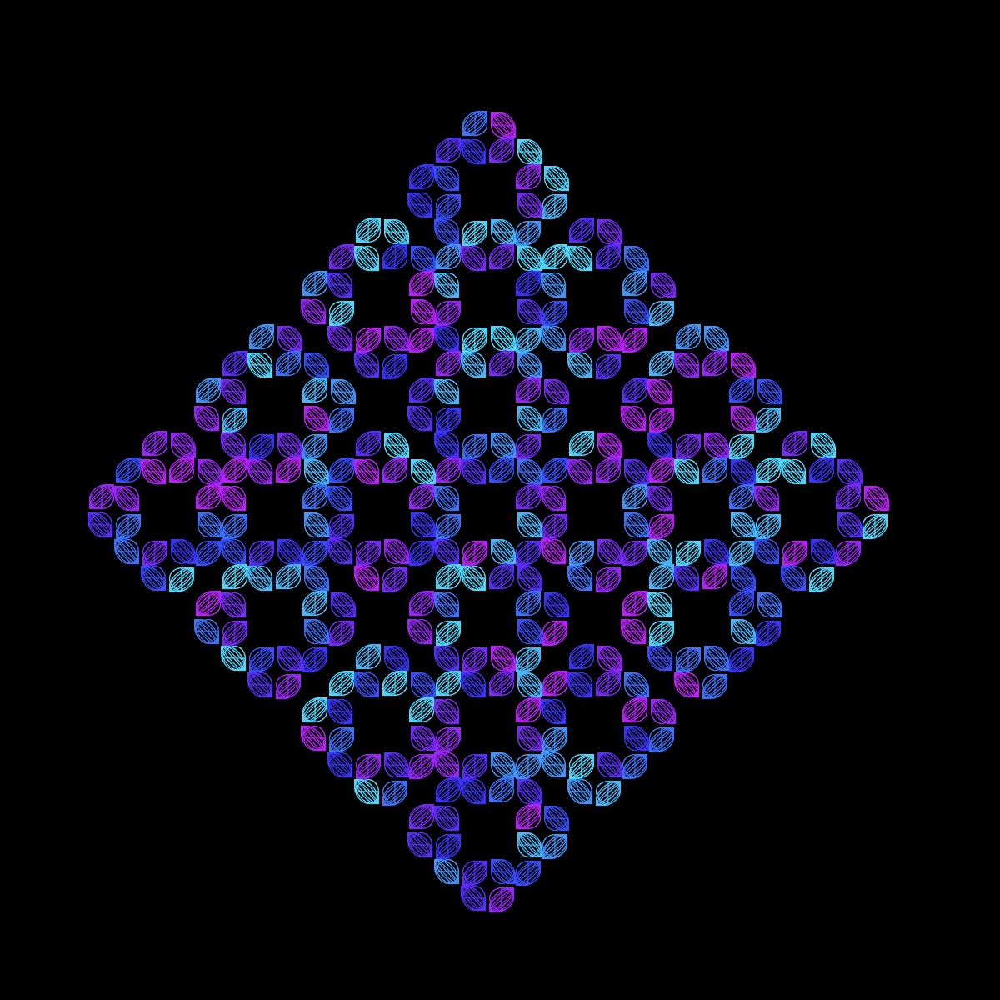
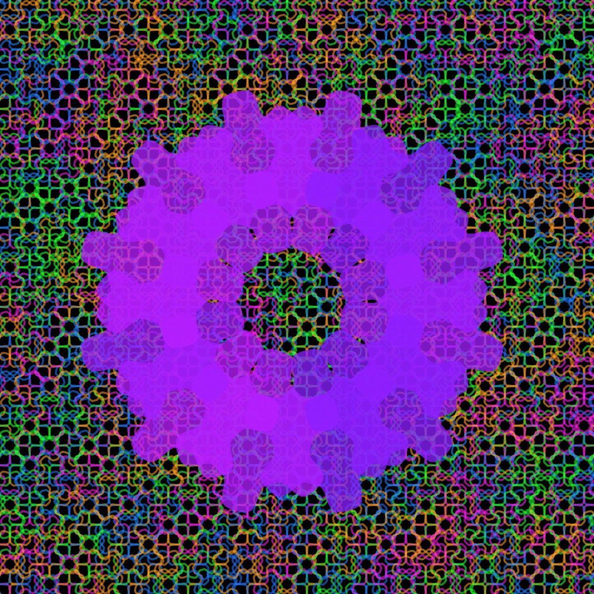

# L-System Pattern Generator

From Wikipedia:

> "An L-system or Lindenmayer system is a parallel rewriting system and a type of formal grammar. An L-system consists of an alphabet of symbols that can be used to make strings, a collection of production rules that expand each symbol into some larger string of symbols, an initial "axiom" string from which to begin construction, and a mechanism for translating the generated strings into geometric structures."

If you want to learn more about using L-systems to generate fractals, I highly recommend Daniel Shiffman's [Fractal Trees L-system Coding Challenge](https://thecodingtrain.com/challenges/16-l-system-fractal-trees). I have used the [L-system formulas by Paul Bourke](https://paulbourke.net/fractals/lsys/) to generate these designs. The rulesets can be found in the ruleset.json file. The code for the shapes is pulled from a couple of different sources: [The Coding Train](https://thecodingtrain.com), [Mathcurve.com](https://mathcurve.com), and [Wolfram Mathworld](https://mathworld.wolfram.com/topics/Curves.html)

I have experimented with inserting different shapes--including gears, spirals, ovals, and even the supershape--into different L-system rule-sets. It is hard to predict, in advance, whether a particular rule-set/shape combination is going to produce a nice design, but trial and error have resulted in some pretty cool patterns. The current version of the sketch will render two different rule-sets. Here is a link to my [p5-sketch](https://editor.p5js.org/kfahn/sketches/urn2wJ8qM) if you would like to have fun yourself.

Daniel Shiffman recently recleased a [Coding Challenge](https://thecodingtrain.com/challenges/185-dragon-curve) on the dragon fractal, and my experiments started with the Dragon rule-set. One of my favorites is this image, which was created using two dragon fractals filled with the gear curve (level 12).

Since many of the shapes are a function of parameters that can be altered, I added sliders to experiment with different rule-set/shape curve combinations. Sometimes when you insert a shape into a rule-set, the result is quite different from the typical visualization. One example is inserting the cassini curve into the Hilbert rule-set. I am not sure that many people would look at this image and realize how it was generated.

I have discovered that both the Hilbert and Peano curve rule-sets can be used to generate some nice backgrounds. Here are two examples.

Hilbert curve rule-set with gear curve (purple background) and ADH23a ruleset with bicorn shape:

Peano curve rule-set with superellipse and rounded cross:

## Fractal Trees

Of course, one of the original applications for L-systems is creating realistic looking trees. I think adding a shape to the rule-set can improve the look of the trees. For example, here is a tree rendered with the zig-zag curve.

## Palettes

I also want to give a shout-out to [supercolorpalette.com](https://supercolorpalette.com)! I started out by creating a json file with palettes, but eventually found the supercolorpalette website. I was able to get the HEX codes from the url, and then create palette arrays very easily with some helper functions from chatGPT -- so much easier and faster than manually creating the palette arrays.

You can find example sketches [here](https://editor.p5js.org/kfahn/collections/BreDLmlQZ).

## 🌄 Gallery

<!-- IMAGE-LIST:START - Do not remove or modify this section -->
<!-- prettier-ignore-start -->
<!-- markdownlint-disable -->
<table>
  <tbody>
   <tr>
     <td align="center"><a href="">  <b> Dragon curve with astroid</b></a></td>
     <td align="center"><a href="">  <b> Dragon rule-set with archimedes spiral</b></a></td>
    </tr>
    <tr>
     <td align="center"><a href="">  <b> Krishna's Anklet rule-set with gear curve</b></a></td>
     <td align="center"><a href="">  <b> Mango leaf with astroid shape</b></a></td>
    </tr>
    <tr>
     <td align="center"><a href="">  <b> Doily rule-set with cornu spiral</b></a></td>
     <td align="center"><a href="">  <b> Square skierpinski with lissajous curve</b></a></td>
</tr>
<tr>
      <td align="center"><a href="">  <b> Crystal rule-set with rose curve</b></a></td>
      <td align="center"><a href="">  <b> Crystal rule-set with ceva curve</b></a></td>
       </tr>
    <tr>
       <td align="center"><a href="">  <b> Snake kolam rule set with kiss curve</b></a></td>
       <td align="center"><a href="">  <b> Krisna anklet with the supershape</b></a></td>
  </tr>
  <tr>
      <td align="center"><a href="">  <b> Peano ruleset background with recursive circles</b></a></td>
      <td align="center"><a href="">  <b> Hilbert ruleset background with circular ruleset</b></a></td>
       </tr>
  
    
 </tbody>
</table>

<!-- markdownlint-restore -->
<!-- prettier-ignore-end -->

<!-- IMAGE-LIST:END -->

## References

- [GraphicalLSystems](https://demonstrations.wolfram.com/GraphicalLSystems/) -[l-systems](https://fedimser.github.io/l-systems.html)
- [L-system](https://en.wikipedia.org/wiki/L-system)
- [LSystemCreator](https://anuraghazra.dev/LSystemCreator/)
- [L-system-generator](https://onlinetools.com/math/l-system-generator)
- [L-systems generator](https://codepen.io/mittense/pen/XemxRN)
- [LSystemPlot](https://resources.wolframcloud.com/FunctionRepository/resources/LSystemPlot/)
- [l-system-to-generate-the-penrose-p3-tiling](https://computergraphics.stackexchange.com/questions/13903/l-system-to-generate-the-penrose-p3-tiling)
- [Penrose](https://processing.org/examples/penrosetile.html)
- [Principles of L-Systems](https://www.houdinikitchen.net/wp-content/uploads/2019/12/L-systems.pdf)
- [Penrose Rhomb](https://tilings.math.uni-bielefeld.de/substitution/penrose-rhomb/)
- [What-is-the-l-system-be-to-generate-an-penrose-p3-tiling](https://stackoverflow.com/questions/77946512/what-is-the-l-system-be-to-generate-an-penrose-p3-tiling)
- [l-systems-and-penrose-p3-in-inkscape](https://thebrickinthesky.wordpress.com/2013/03/17/l-systems-and-penrose-p3-in-inkscape/)
- [more-l-system-fractal-fun](http://a-d-c.ca/more-l-system-fractal-fun/#page-content) -[is-there-an-l-system-for-aperiodic-tilings-of-the-plane-with-the-hat-monotile](https://mathoverflow.net/questions/444513/is-there-an-l-system-for-aperiodic-tilings-of-the-plane-with-the-hat-monotile)
