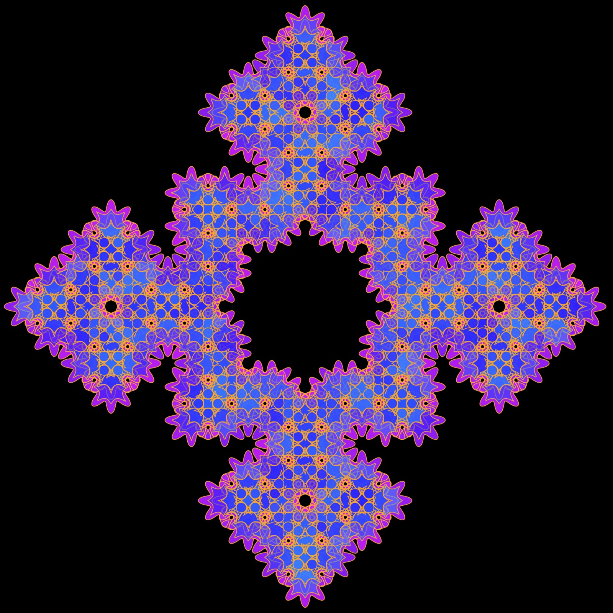

# L-System Pattern Generator

This repository contains code to render L-systems with different polar shapes. You can play with the pattern generator [here](https://editor.p5js.org/kfahn/full/Mdejk-YHM). You can view examples of patterns I have created [here](https://kfahn22.github.io/l-system-examples/). You can find example sketches [here](https://editor.p5js.org/kfahn/collections/BreDLmlQZ).  It is also [here](https://openprocessing.org/sketch/2408150).

From Wikipedia:
> "An L-system or Lindenmayer system is a parallel rewriting system and a type of formal grammar. An L-system consists of an alphabet of symbols that can be used to make strings, a collection of production rules that expand each symbol into some larger string of symbols, an initial "axiom" string from which to begin construction, and a mechanism for translating the generated strings into geometric structures."

If you want to learn more about using L-systems to generate fractals, I highly recommend Daniel Shiffman's [Fractal Trees L-system Coding Challenge](https://thecodingtrain.com/challenges/16-l-system-fractal-trees). I have used the [L-system formulas by Paul Bourke](https://paulbourke.net/fractals/lsys/) to generate these designs. The rulesets can be found in the ruleset.json file. The code for the shapes is pulled from a couple of different sources: [The Coding Train](https://thecodingtrain.com), [Mathcurve.com](https://mathcurve.com), and [Wolfram Mathworld](https://mathworld.wolfram.com/topics/Curves.html)

I have experimented with inserting different shapes--including gears, spirals, ovals, and even the supershape--into different L-system rule-sets. It is hard to predict, in advance, whether a particular rule-set/shape combination is going to produce a nice design, but trial and error have resulted in some pretty cool patterns. The current version of the sketch will render two different rule-sets. Here is a link to the latest version of my [p5-sketch](https://editor.p5js.org/kfahn/sketches/KmKxgvx03).

Daniel Shiffman recently recleased a [Coding Challenge](https://thecodingtrain.com/challenges/185-dragon-curve) on the dragon fractal, and my experiments started with the Dragon rule-set. One of my favorites is this image, which was created using two dragon fractals filled with the gear curve (level 12).

Since many of the shapes are a function of parameters that can be altered, I added sliders to experiment with different rule-set/shape curve combinations. Sometimes when you insert a shape into a rule-set, the result is quite different from the typical visualization. One example is inserting the cassini curve into the Hilbert rule-set. I am not sure that many people would look at this image and realize how it was generated.

I have discovered that both the Hilbert and Peano curve rule-sets can be used to generate some nice backgrounds. Here is the Hilbert curve rule-set rendered with the gear curve (purple background) and the ADH23a ruleset with bicorn shape:

Why stop with just one ruleset or shape? Here I have rendered the ADH231a ruleset twice with the flower and supershape curves.  

## Fractal Trees

Of course, one of the original applications for L-systems is creating realistic looking trees. I think adding a shape to the rule-set can improve the look of the trees. For example, here is a tree rendered with the zig-zag curve.

## Palettes

I also want to give a shout-out to [supercolorpalette.com](https://supercolorpalette.com)! I started out by creating a json file with palettes, but eventually found the supercolorpalette website. I was able to get the HEX codes from the url, and then create palette arrays very easily with some helper functions from chatGPT -- so much easier and faster than manually creating the palette arrays.

## Learn More

- [Learn more about the L-systems](docs/RULE-SETS/rule-sets.md)
- [Learn more about polar shapes](docs/POLAR-SHAPES/polar-shapes.md)

## References

- [Graphical LSystems](https://demonstrations.wolfram.com/GraphicalLSystems/)
- [L-system formulas by Paul Bourke](https://paulbourke.net/fractals/lsys/)  
- [l-systems](https://fedimser.github.io/l-systems.html)
- [L-system](https://en.wikipedia.org/wiki/L-system)
- [LSystemCreator](https://anuraghazra.dev/LSystemCreator/)
- [L-system-generator](https://onlinetools.com/math/l-system-generator)
- [L-systems generator](https://codepen.io/mittense/pen/XemxRN)
- [LSystemPlot](https://resources.wolframcloud.com/FunctionRepository/resources/LSystemPlot/)
- [Principles of L-Systems](https://www.houdinikitchen.net/wp-content/uploads/2019/12/L-systems.pdf)
- [more-l-system-fractal-fun](http://a-d-c.ca/more-l-system-fractal-fun/#page-content)
 