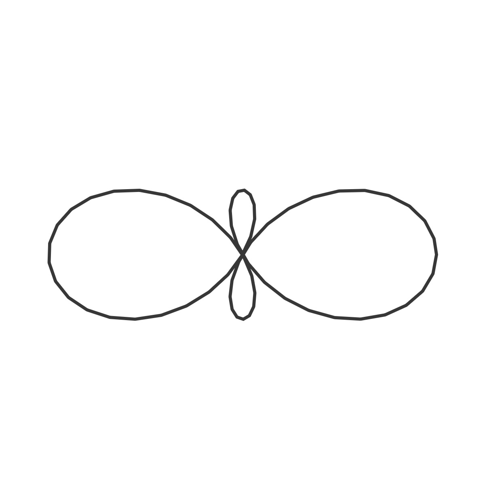

# Ceva

## 🌄 Gallery

<!-- IMAGE-LIST:START - Do not remove or modify this section -->
<!-- prettier-ignore-start -->
<!-- markdownlint-disable -->
<table>
  <tbody>
   <tr>
     <td align="center"><a href="">  <b> Peano with cassini oval, a = 0.7, b =0.9</b></a></td>
     <td align="center"><a href="">  <b> Peano ruleset with cassini oval</b></a></td>
    </tr>
    <tr>
     <td align="center"><a href="">  <b> Snake-kolam ruleset with cassini oval</b></a></td>
     <td align="center"><a href="">  <b> Box  rule-set with cassini oval</b></a></td>
    </tr>
    
  
    
 </tbody>
</table>

<!-- markdownlint-restore -->
<!-- prettier-ignore-end -->

<!-- IMAGE-LIST:END -->
