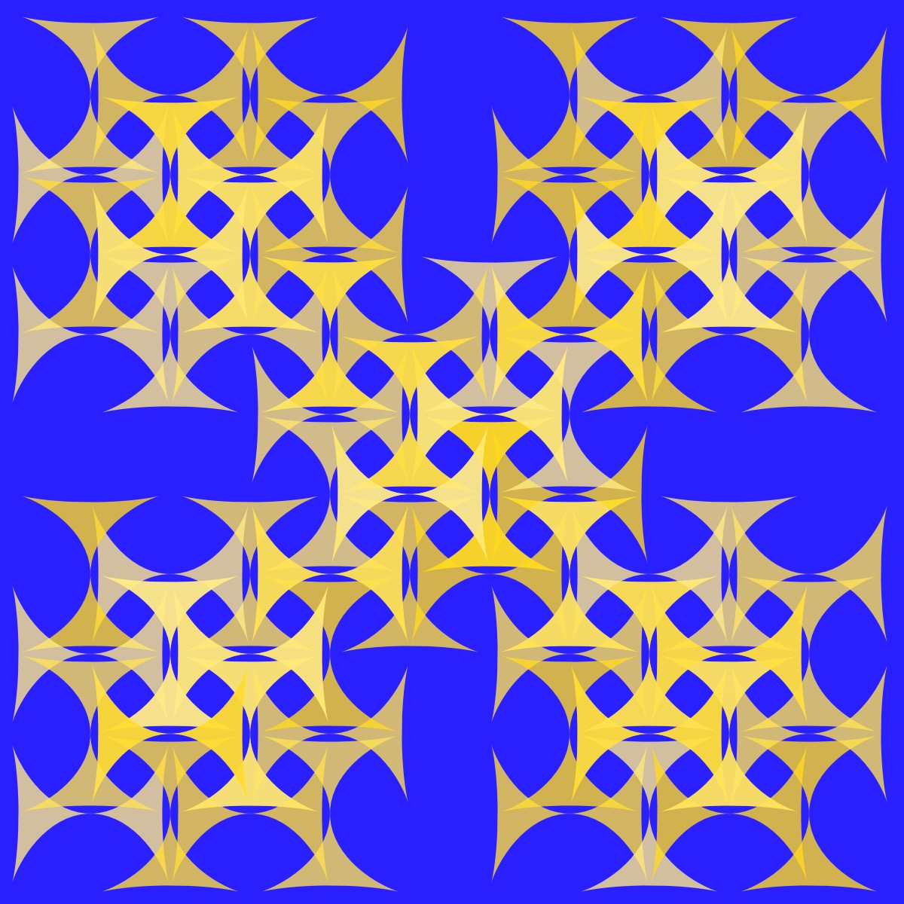
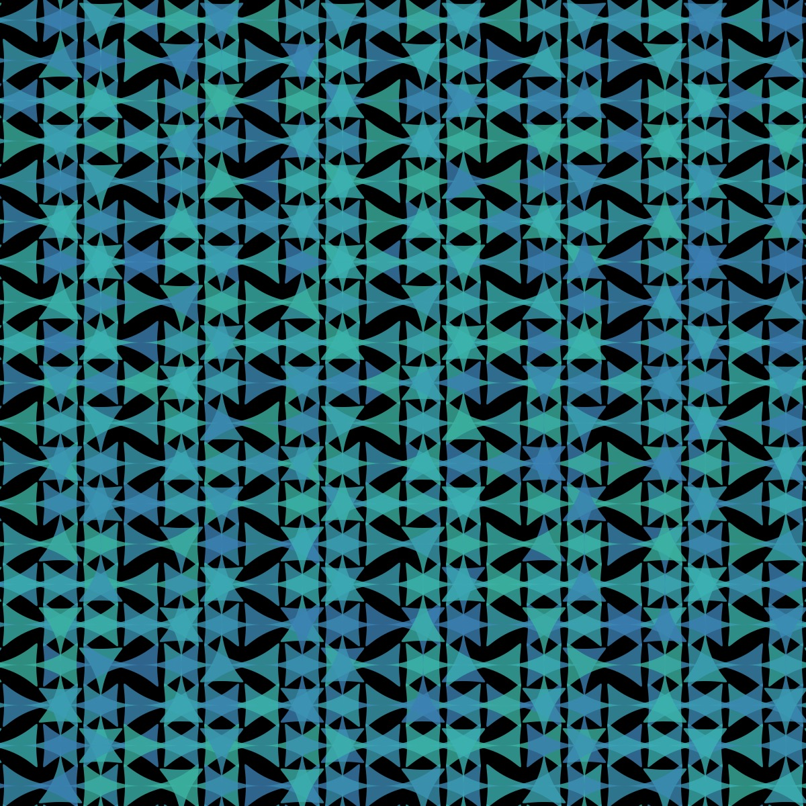
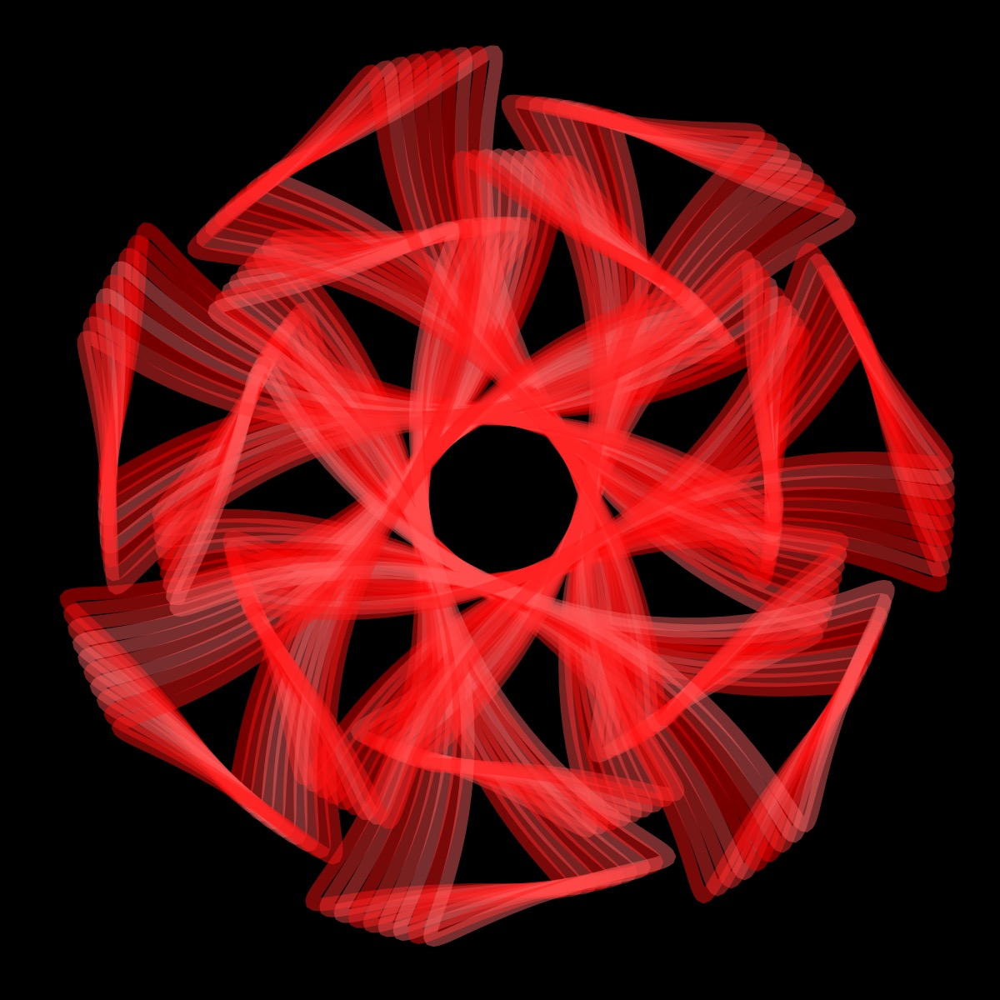

# Maltese Cross

<p align="center"></p>

Code:

```JavaScript
malteseCross() {
    for (let theta = 0.1; theta < TWO_PI; theta += 0.05) {
      let x = this.r * +cos(theta) * (pow(cos(theta), 2) - this.a);
      let y = this.r * +this.b * sin(theta) * pow(cos(theta), 2);
      this.points.push(createVector(x, y));
    }
}
```

[Source](https://mathcurve.com/courbes2d.gb/croixdemalte/croixdemalte.shtml)

## 🌄 Gallery

<!-- IMAGE-LIST:START - Do not remove or modify this section -->
<!-- prettier-ignore-start -->
<!-- markdownlint-disable -->
<table>
  <tbody>
   <tr>
     <td align="center"><a href=""> <br /><sub><b><br/>Box ruleset with cross curve</b></sub></a></td>
     <td align="center"><a href=""> <br /><sub><b><br/>Two Recursive circle rulesets with cross</b></sub></a></td>
    </tr>
    <tr>
     <td align="center"><a href=""> <br /><sub><b><br/>Peano curve with cross, a = 2.4, b = 1.4</b></sub></a></td>
    <td align="center"><a href=""> <br /><sub><b><br/>Round star with cross curve, a = 2, b = 2.5</b></sub></a></td>
 </tbody>
</table>

<!-- markdownlint-restore -->
<!-- prettier-ignore-end -->

<!-- IMAGE-LIST:END -->
