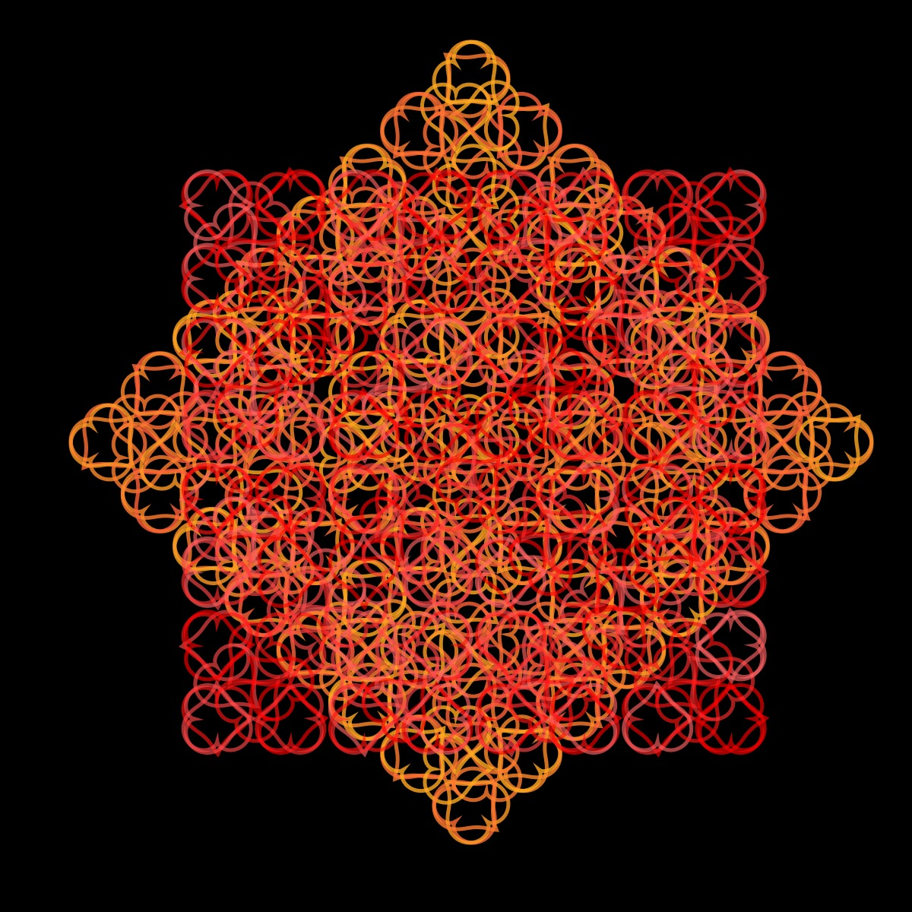

# Heart

To learn more about the heart curve, I recommend watching Daniel Shiffman's [Heart Coding Challenge](https://thecodingtrain.com/challenges/134-heart-curve).

<p align="center"></p>

Code:

```JavaScript
heart() {
    for (let theta = 0; theta < 2 * PI; theta += 0.05) {
      const r =
        2 -
        2 * sin(theta) +
        sin(theta) * (pow(abs(cos(theta)), 0.5) / (sin(theta) + 1.4));
      const x = this.r * r * cos(theta);
      const y = this.r * r * sin(theta);
      this.points.push(createVector(x, y));
    }
}
```

[Source](https:mathworld.wolfram.com/HeartCurve.html)

## 🌄 Gallery

<!-- IMAGE-LIST:START - Do not remove or modify this section -->
<!-- prettier-ignore-start -->
<!-- markdownlint-disable -->
<table>
  <tbody>
   <tr>
     <td align="center"><a href=""> <br /><sub><b><br/>ADH231a ruleset with heart</b></sub></a></td>
     <td align="center"><a href=""> <br /><sub><b><br/>Rounded Star with heart</b></sub></a></td>
    </tr>
    <tr>
     <td align="center"><a href=""> <br /><sub><b><br/>Snake-kolam ruleset with heart curve</b></sub></a></td>
     <td align="center"><a href=""> <br /><sub><b><br/>Skierpinski rule-set with heart curve</b></sub></a></td>
    </tr>
 </tbody>
</table>

<!-- markdownlint-restore -->
<!-- prettier-ignore-end -->

<!-- IMAGE-LIST:END -->
