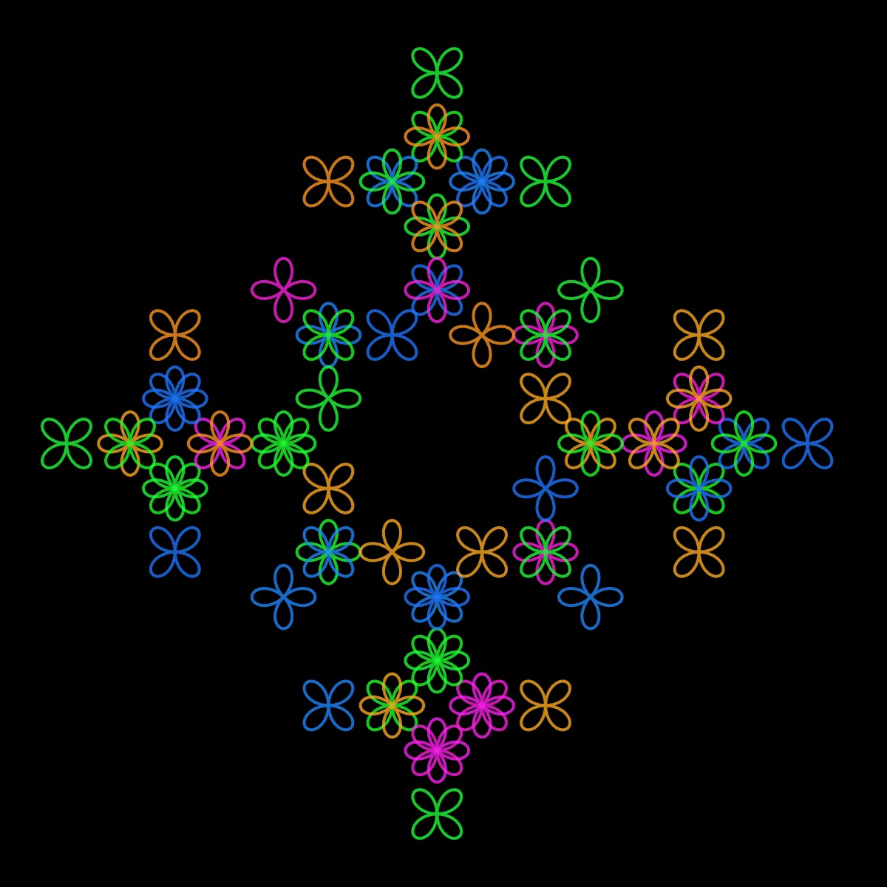
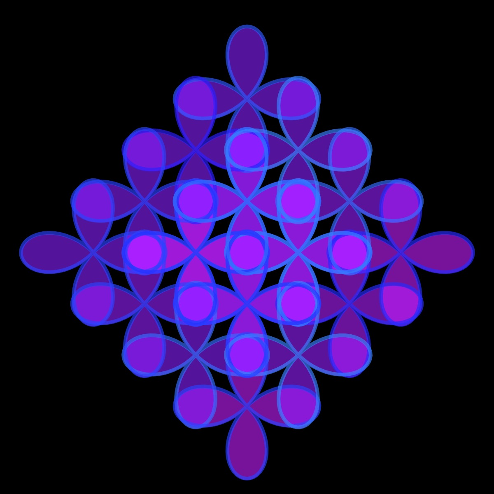
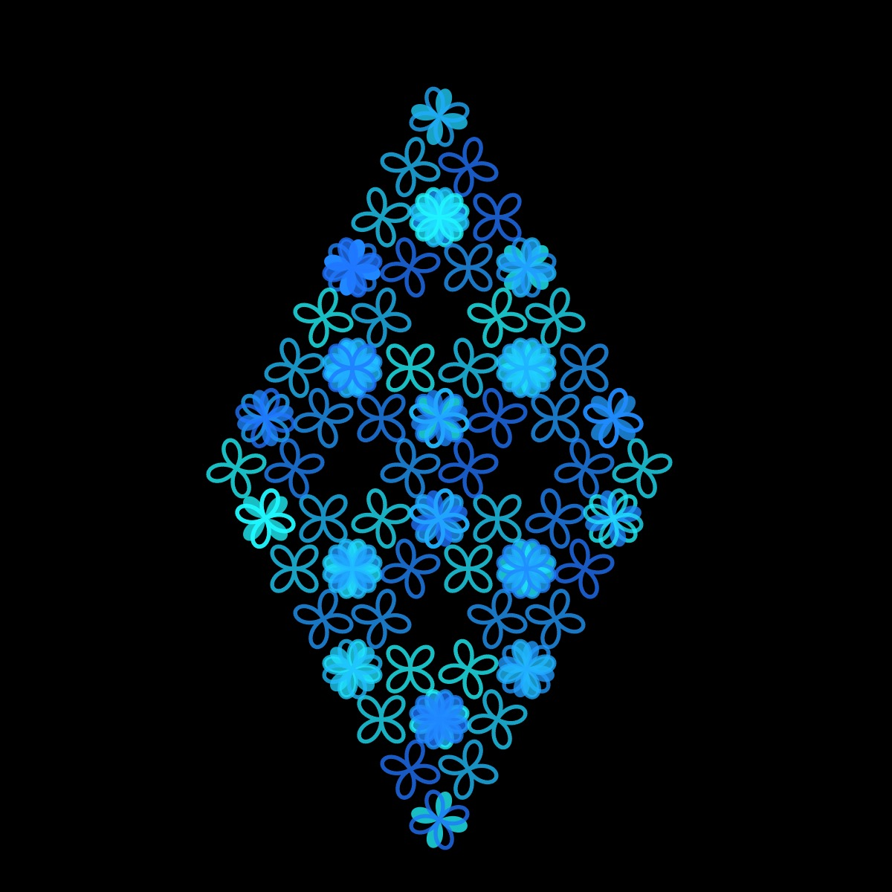
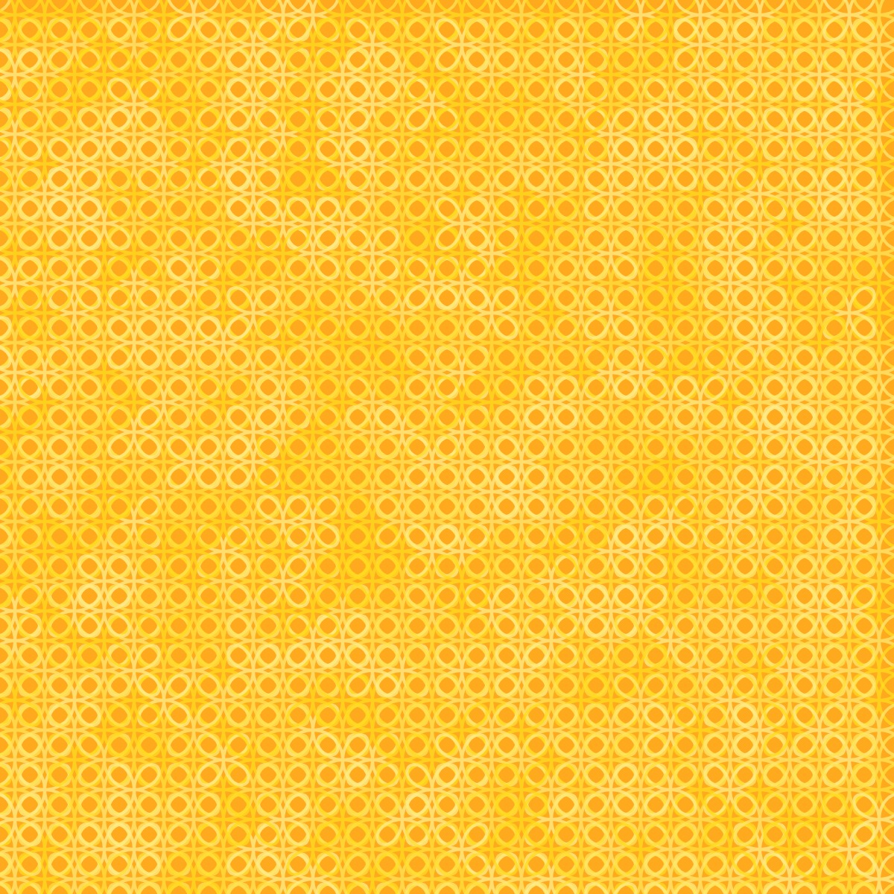

# Quadrifolium Curve

<p align="center"></p>

Code:

```JavaScript
quadrifolium() {
    let a = 1;
    for (let theta = 0; theta < TWO_PI; theta += 0.1) {
      let x = this.r * (2 * a * pow(sin(theta), 2) * cos(theta));
      let y = this.r * (2 * a * pow(cos(theta), 2) * sin(theta));
      this.points.push(createVector(x, y));
    }
  }
```

[Source](https://mathcurve.com/courbes2d.gb/bouche/bouche.shtml)

## 🌄 Gallery

<!-- IMAGE-LIST:START - Do not remove or modify this section -->
<!-- prettier-ignore-start -->
<!-- markdownlint-disable -->
<table>
  <tbody>
   <tr>
     <td align="center"><a href=""> <br /><sub><b><br/>ADH231a ruleset with quadrifolium curve</b></sub></a></td>
     <td align="center"><a href=""> <br /><sub><b><br/>Kolam rulesset with quadrifolium curve</b></sub></a></td>
    </tr>
    <tr>
     <td align="center"><a href=""> <br /><sub><b><br/>Mango leaf ruleset with quadrifolium curve</b></sub></a></td>
     <td align="center"><a href=""> <br /><sub><b><br/>Box  rule-set with kiss curve</b></sub></a></td>
    </tr>
    
  
    
 </tbody>
</table>

<!-- markdownlint-restore -->
<!-- prettier-ignore-end -->

<!-- IMAGE-LIST:END -->
