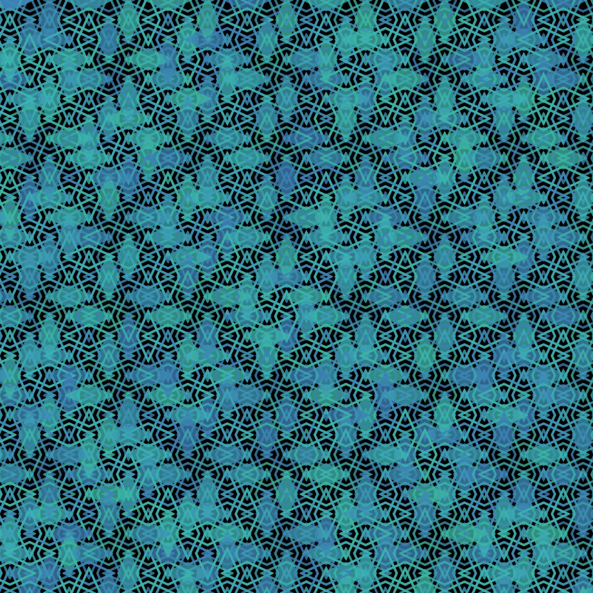

# Superellipse

To learn mroe about the superellipse, I recommend watching Daniel Shiffman's [Coding Challenge](https://thecodingtrain.com/challenges/19-superellipse).

<p align="center"></p>

```JavaScript
sgn(val) {
    if (val == 0) {
      return 0;
    }
    return val / abs(val);
}

superellipse() {
    for (let theta = 0; theta < TWO_PI; theta += 0.05) {
      let na = 2 / this.n;
      let x = this.r * pow(abs(cos(theta)), na) * this.a * this.sgn(cos(theta));
      let y = this.r * pow(abs(sin(theta)), na) * this.b * this.sgn(sin(theta));
      this.points.push(createVector(x, y));
    }
}
```

## 🌄 Gallery

<!-- IMAGE-LIST:START - Do not remove or modify this section -->
<!-- prettier-ignore-start -->
<!-- markdownlint-disable -->
<table>
  <tbody>
   <tr>
     <td align="center"><a href=""> <br /><sub><b><br/>Hilbert curve background with box rule-set</b></sub></a></td>
     <td align="center"><a href=""> <br /><sub><b><br/>Rounded Star with superellipse</b></sub></a></td>
    </tr>
    <tr>
     <td align="center"><a href=""> <br /><sub><b><br/>Snake-kolam ruleset with superellipse</b></sub></a></td>
     <td align="center"><a href=""> <br /><sub><b><br/>Recurvsive circles2 rule-set, a=3.6,b=1.15,n=1.5</b></sub></a></td>
    </tr>
    
  
    
 </tbody>
</table>

<!-- markdownlint-restore -->
<!-- prettier-ignore-end -->

<!-- IMAGE-LIST:END -->
