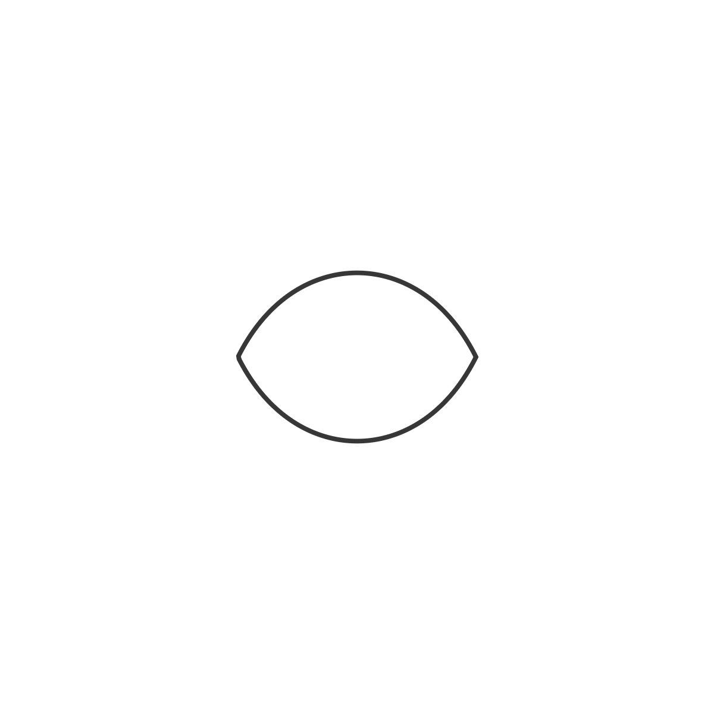
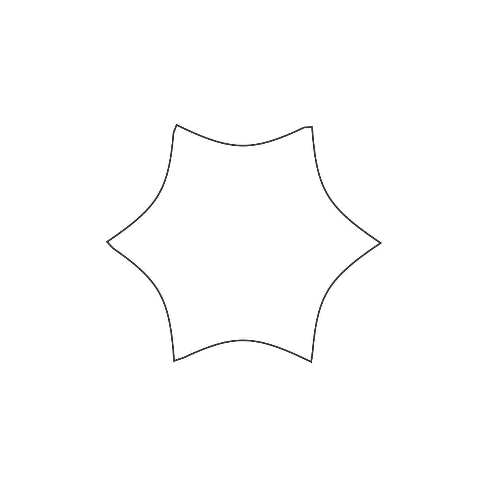
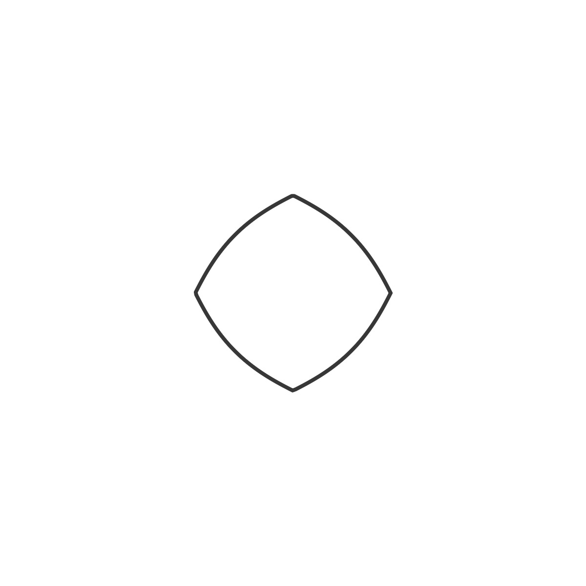
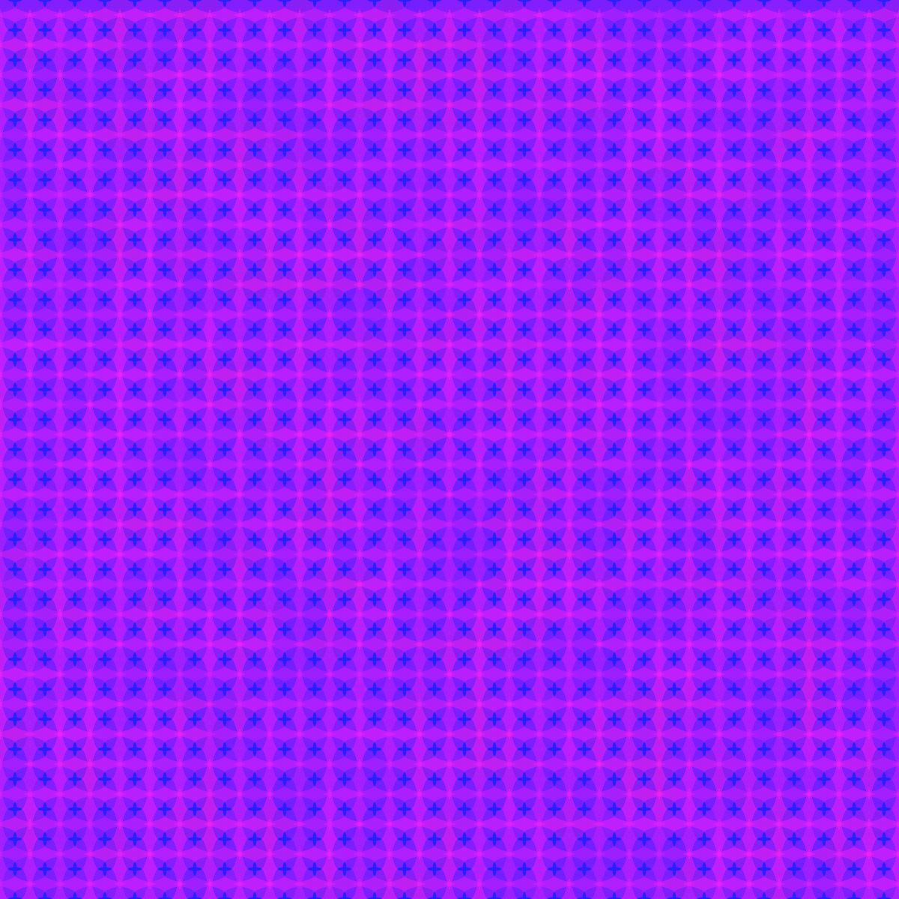
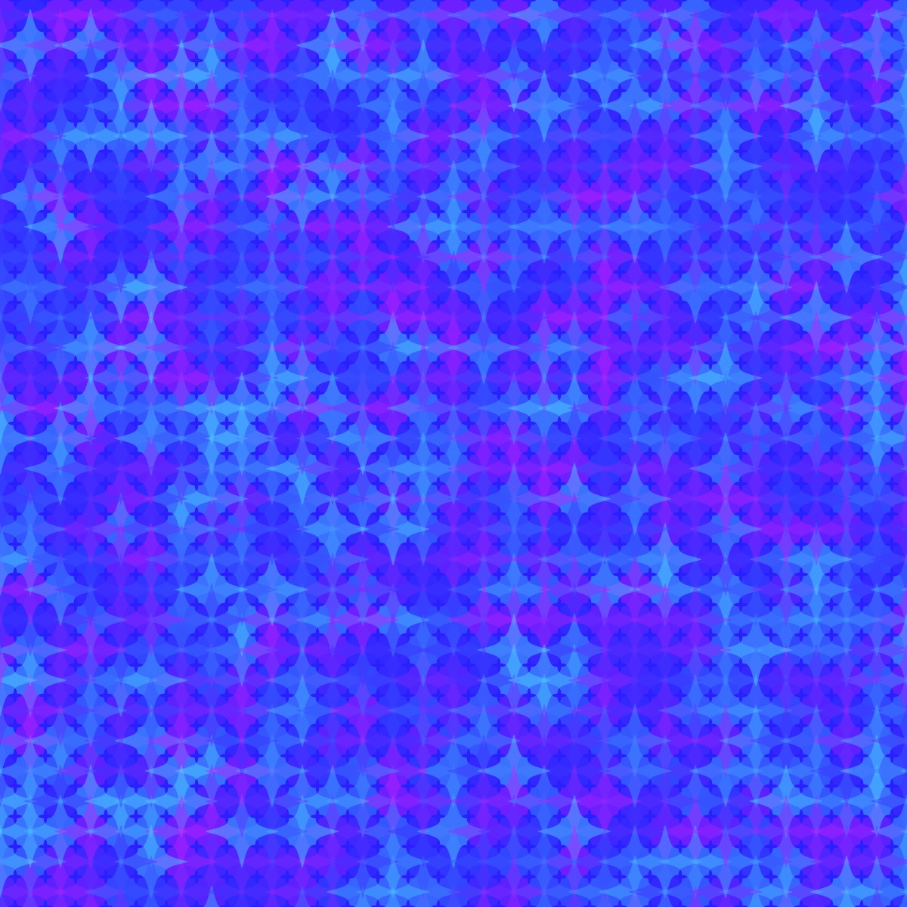
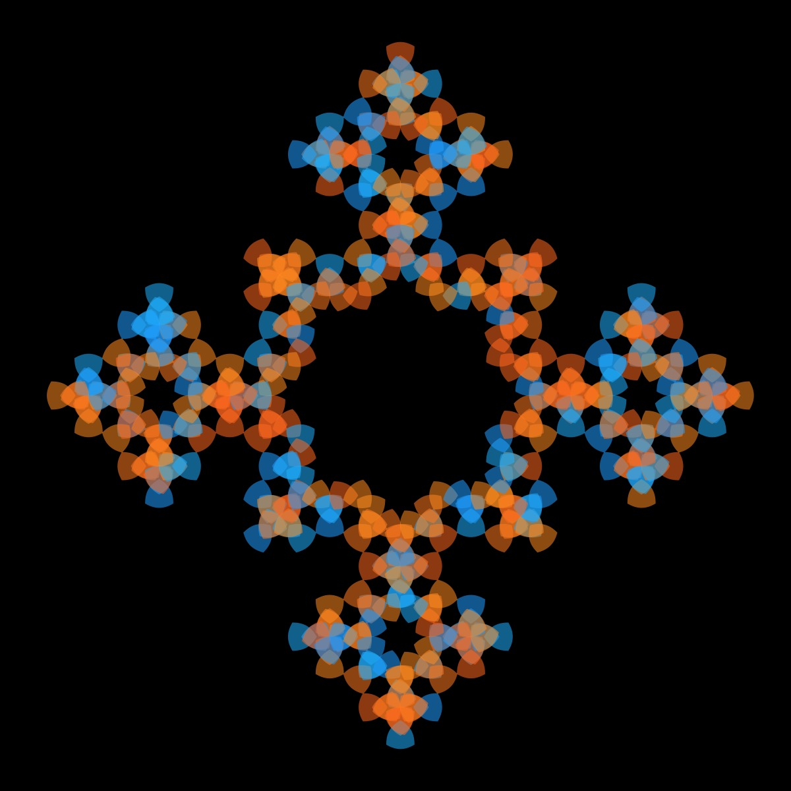

# Supershape

These images were all created with the supershape, which is the most versatile of the curves. It also has the most parameters. The parameter m determines the number of sides, with m=0 resulting in a circle and m = 4 yielding a roundish square. The best way to figure out how the parameters effect the shape is to set the rule-set to "none" and play around with the parameters. To learn more about the supershape curve, I recommend watch Daniel Shiffman's [Supershape Coding Challenge](https://thecodingtrain.com/challenges/23-2d-supershapes). You can also find more information about the supershape and how the parameters affect the shape on [Paul Bourke's website](https://paulbourke.net/geometry/supershape/).

## 🌄 Changing the Supershape Parameters

<!-- IMAGE-LIST:START - Do not remove or modify this section -->
<!-- prettier-ignore-start -->
<!-- markdownlint-disable -->
<table>
  <tbody>
   <tr>
     <td align="center"><a href=""> <br /><sub><b><br/>Supershape with m = 2</b></sub></a></td>
     <td align="center"><a href=""> <br /><sub><b><br/>Supershape with m = 6</b></sub></a></td>
     <td align="center"><a href=""> <br /><sub><b><br/>Supershape with m = 8, n1 =4</b></sub></a></td>
     <td align="center"><a href=""> <br /><sub><b><br/>Supershape with m = 8, a = 1.25, b = 1.05</b></sub></a></td>
    </tr>  
 </tbody>
</table>

<!-- markdownlint-restore -->
<!-- prettier-ignore-end -->

<!-- IMAGE-LIST:END -->

Code:

```JavaScript
superformula(theta) {
    let part1 = (1 / this.a) * cos((theta * this.m) / 4);
    part1 = abs(part1);
    part1 = pow(part1, this.n2);
    let part2 = (1 / this.b) * sin((theta * this.m) / 4);
    part2 = abs(part2);
    part2 = pow(part2, this.n3);
    let part3 = pow(part1 + part2, 1 / this.n1);
    if (part3 === 0) {
      return 0;
    }
    return 1 / part3;
}

supershape() {
    for (let theta = 0; theta <= TWO_PI; theta += 0.05) {
      let r = this.superformula(theta);
      let x = this.r * r * cos(theta);
      let y = this.r * r * sin(theta);
      this.points.push(createVector(x, y));
    }
}
```

One of the fun things about creative coding is that small changes can lead to very different visualizations. For example, in the second row the images were created with all most identical parameters--only the color changed. Due to the color variation in the palette in the first image, you can see the individual shapes, while in the second image they blend in and are almost indestinguishable. In the third row, the ADH231a ruleset was used, but the parameters were changed (and the shapes were filled in second image)yielding completely different patterns.

## 🌄 Gallery

<!-- IMAGE-LIST:START - Do not remove or modify this section -->
<!-- prettier-ignore-start -->
<!-- markdownlint-disable -->
<table>
  <tbody>
   <tr>
     <td align="center"><a href=""> <br /><sub><b><br/>Krishna anklet with supershape curve</b></sub></a></td>
     <td align="center"><a href=""> <br /><sub><b><br/>Pentaplexity with supershape</b></sub></a></td>
    </tr>
    <tr>
     <td align="center"><a href=""> <br /><sub><b><br/>Hilbert curve with supershape</b></sub></a></td>
     <td align="center"><a href=""> <br /><sub><b><br/>Hilbert curve with supershape</b></sub></a></td>
    </tr>
     <tr>
     <td align="center"><a href=""> <br /><sub><b><br/>ADH231a ruleset with supershape, a=0.9, b=2.5, m=8, n1=n2=n3=1;</b></sub></a></td>
     <td align="center"><a href=""> <br /><sub><b><br/>ADH231a ruleset with supershape, a=b=n1=n2=n3=1, m = 3</b></sub></a></td>
    </tr>
    
 </tbody>
</table>

<!-- markdownlint-restore -->
<!-- prettier-ignore-end -->

<!-- IMAGE-LIST:END -->
