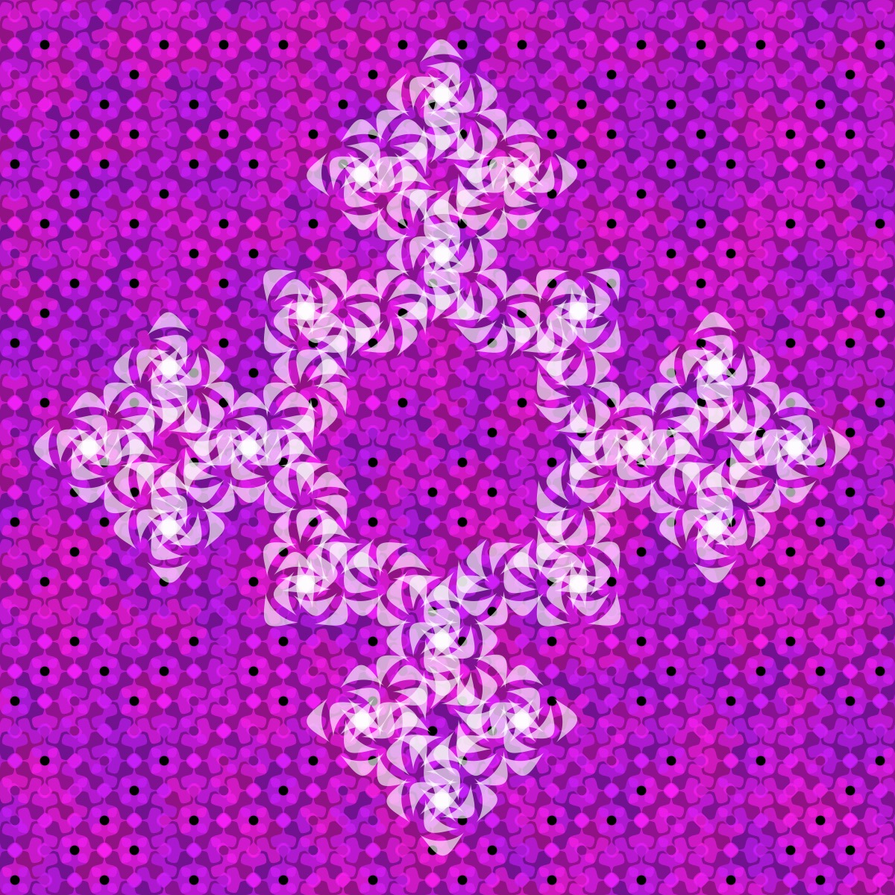
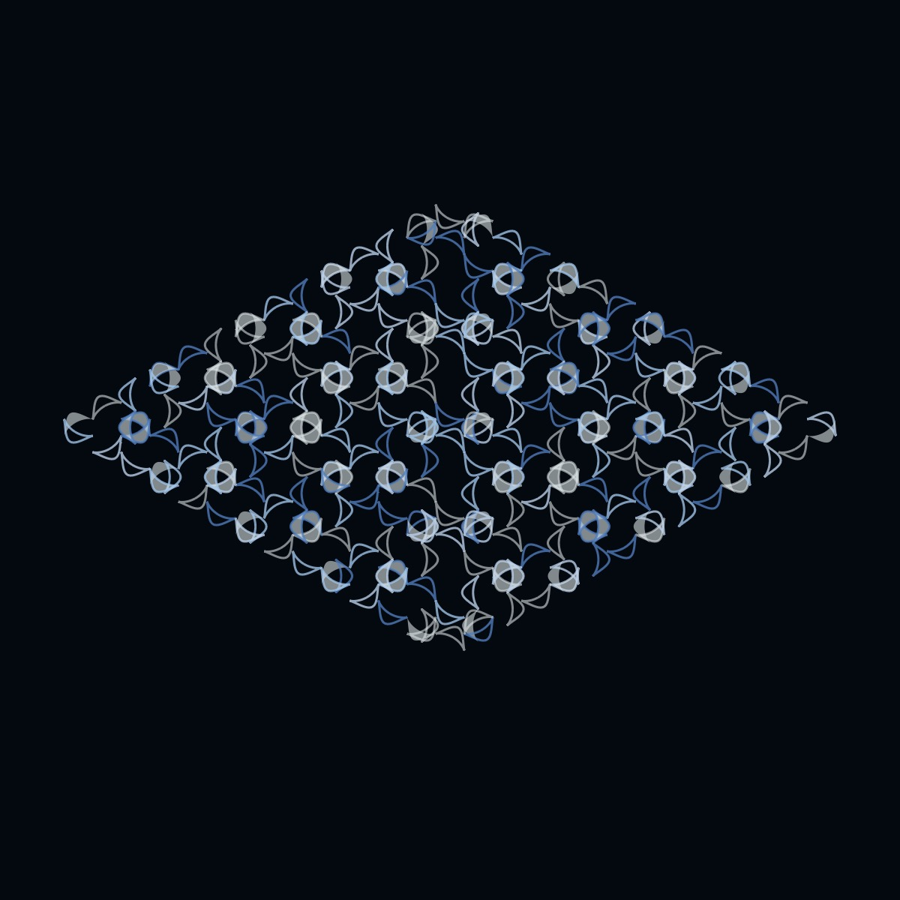

# Bicorn Curve

<p align="center"></p>

Code:

```JavaScript
bicorn() {
    for (let theta = 0; theta < TWO_PI; theta += 0.05) {
      let x = this.r * sin(theta);
      let y = (this.r * pow(cos(theta), 2)) / (2 + cos(theta));
      this.points.push(createVector(x, y));
    }
}
```

[Source](https://mathcurve.com/courbes2d.gb/bicorne/bicorne.shtml)

## 🌄 Gallery

<!-- IMAGE-LIST:START - Do not remove or modify this section -->
<!-- prettier-ignore-start -->
<!-- markdownlint-disable -->
<table>
  <tbody>
   <tr>
     <td align="center"><a href=""> <br /><sub><b><br/>Two ADH23a rule-sets with bicorn curve</b></sub></a></td>
     <td align="center"><a href=""> <br /><sub><b><br/>Recursive circles with bicorn curve</b></sub></a></td>
    </tr>
    <tr>
     <td align="center"><a href=""> <br /><sub><b><br/>ADH23a with bicorn</b></sub></a></td>
     <td align="center"><a href=""> <br /><sub><b><br/>Mango leaf with bicorn curve</b></sub></a></td>
    </tr>
    
  
    
 </tbody>
</table>

<!-- markdownlint-restore -->
<!-- prettier-ignore-end -->

<!-- IMAGE-LIST:END -->
