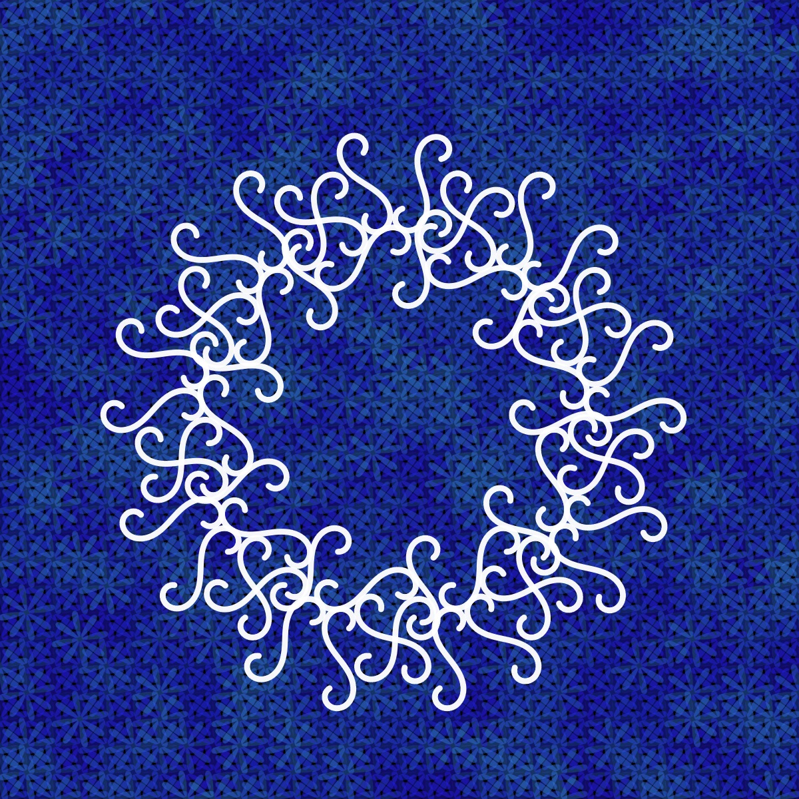
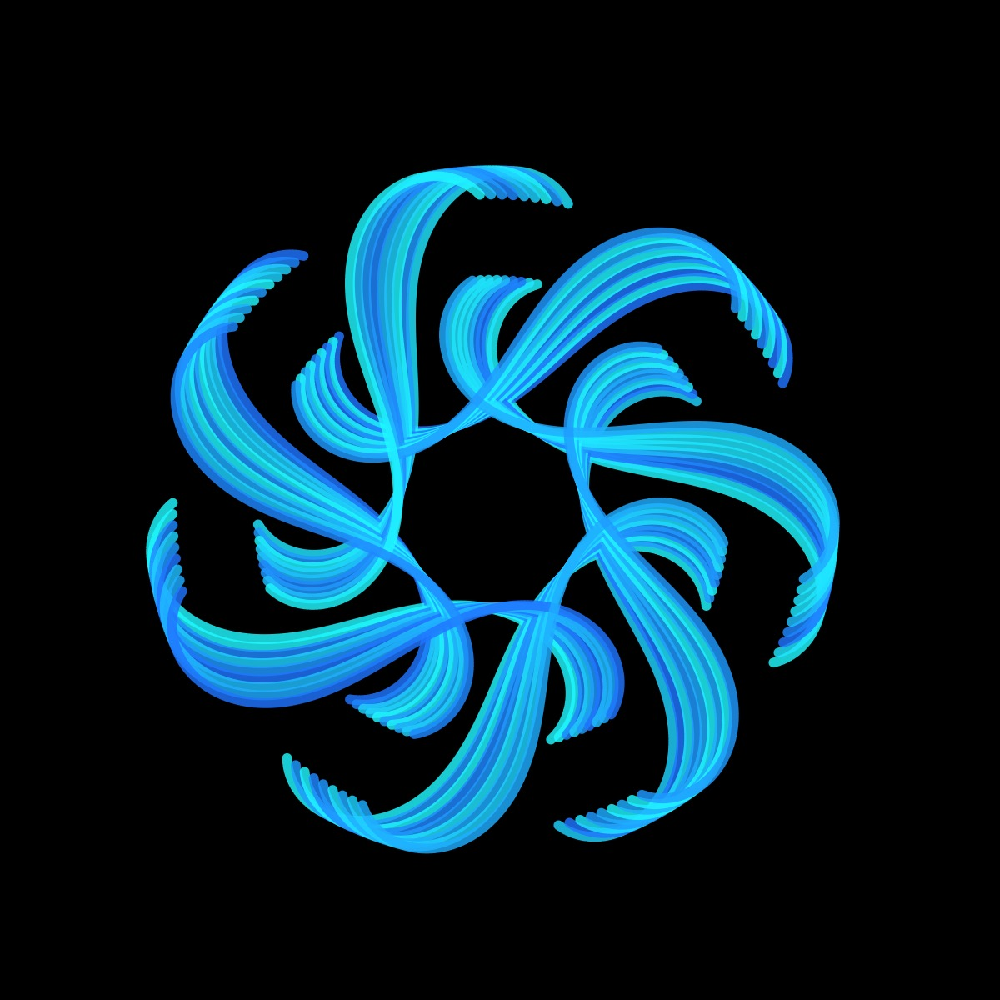
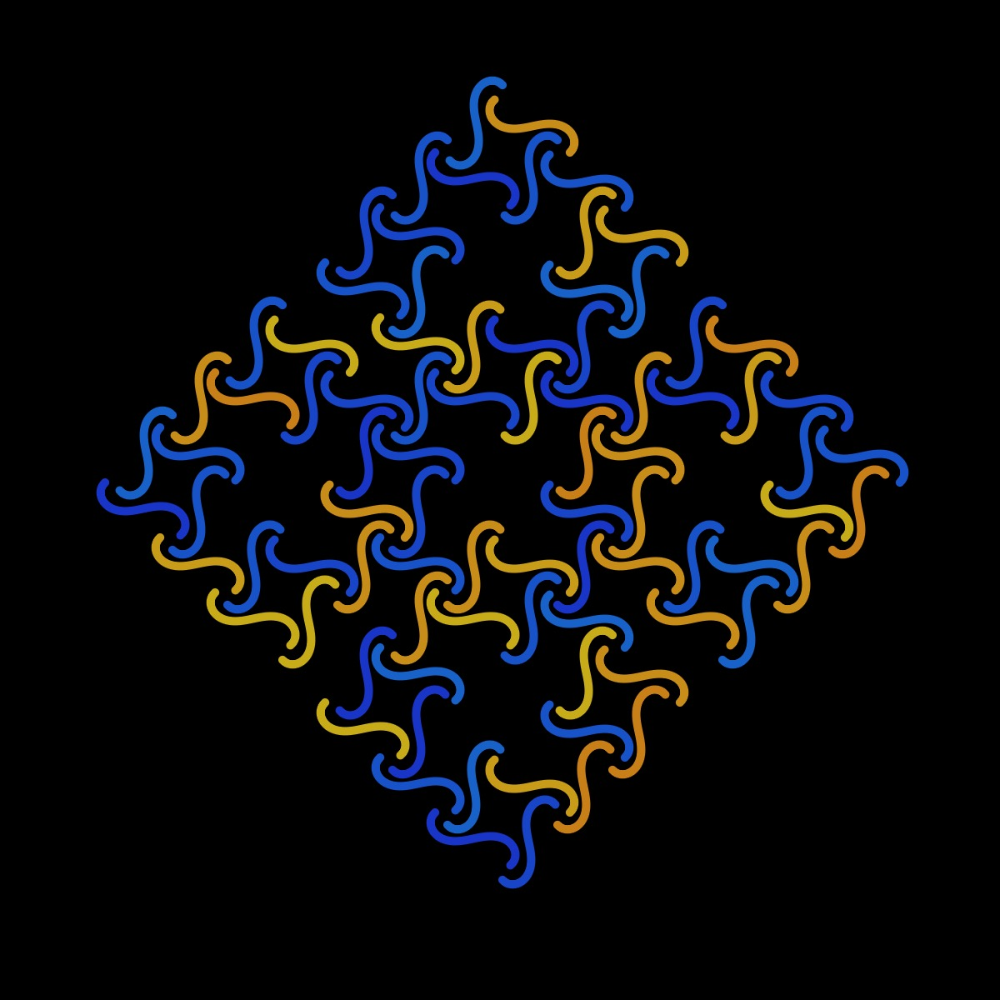
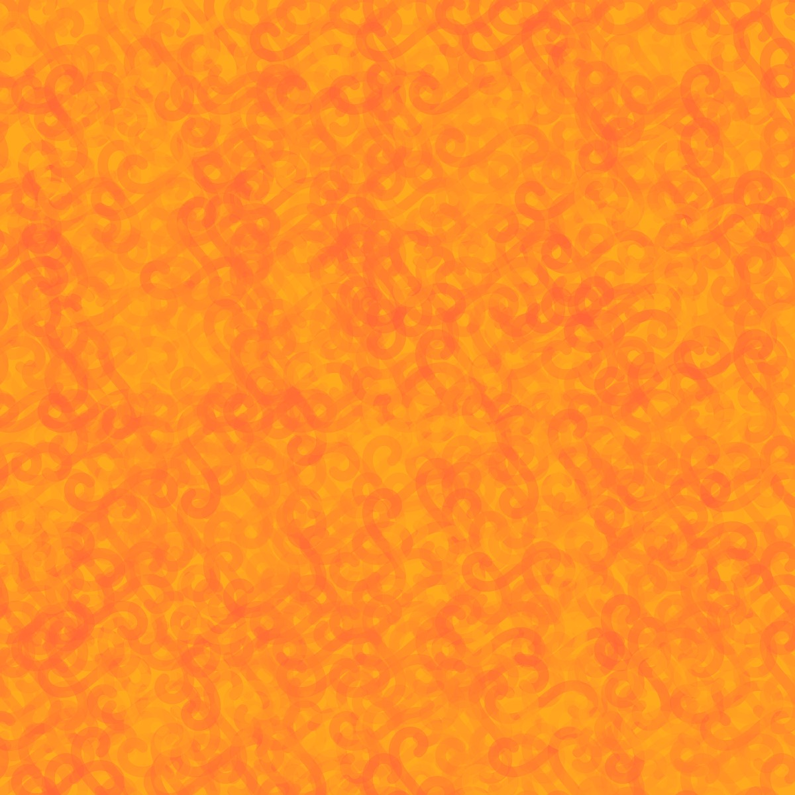

# Cornu Spiral

<p align="center"></p>

Code:

```fresnelC(t) {
    let sum = 0;
    let n = 50;
    let dt = t / n;
    for (let i = 0; i < n; i++) {
      let u = i * dt;
      sum += cos((u * u) / 2) * dt;
    }
    return sum;
}

fresnelS(t) {
    let sum = 0;
    let n = 50;
    let dt = t / n;
    for (let i = 0; i < n; i++) {
      let u = i * dt;
      sum += sin((u * u) / 2) * dt;
    }
    return sum;
}

cornuSpiral() {
    let numPoints = 200;
    let maxT = this.a * PI;
    for (let i = 0; i < numPoints; i++) {
      let t = map(i, 0, numPoints, -maxT, maxT);
      let x = this.n + this.r * this.fresnelC(t);
      let y = this.n + this.r * this.fresnelS(t);
      this.points.push(createVector(x, y));
    }
}```

Sources:

- [Mathcurve - cornu spiral](https://mathcurve.com/courbes2d.gb/cornu/cornu.shtml)
- [Virtual Math Museum - clothoid]https://virtualmathmuseum.org/Curves/clothoid/kappaCurve.html

## 🌄 Gallery

<!-- IMAGE-LIST:START - Do not remove or modify this section -->
<!-- prettier-ignore-start -->
<!-- markdownlint-disable -->
<table>
  <tbody>
   <tr>
     <td align="center"><a href=""> <br /><sub><b><br/>Recursive circles with cornu spiral</b></sub></a></td>
     <td align="center"><a href=""> <br /><sub><b><br/>Rounded Star with cornu spiral</b></sub></a></td>
    </tr>
    <tr>
     <td align="center"><a href=""> <br /><sub><b><br/>Square skierpinski with cornu spiral</b></sub></a></td>
     <td align="center"><a href=""> <br /><sub><b><br/>Hilbert curve with cornu spiral</b></sub></a></td>
    </tr>


 </tbody>
</table>

<!-- markdownlint-restore -->
<!-- prettier-ignore-end -->

<!-- IMAGE-LIST:END -->
# Cornu Spiral

## 🌄 Gallery

<!-- IMAGE-LIST:START - Do not remove or modify this section -->
<!-- prettier-ignore-start -->
<!-- markdownlint-disable -->
<table>
  <tbody>
   <tr>
     <td align="center"><a href=""> <br /><sub><b><br/>Recursive circles with cornu spiral</b></sub></a></td>
     <td align="center"><a href=""> <br /><sub><b><br/>Rounded Star with cornu spiral</b></sub></a></td>
    </tr>
    <tr>
     <td align="center"><a href=""> <br /><sub><b><br/>Square skierpinski with cornu spiral</b></sub></a></td>
     <td align="center"><a href=""> <br /><sub><b><br/>Hilbert curve with cornu spiral</b></sub></a></td>
    </tr>


 </tbody>
</table>

<!-- markdownlint-restore -->
<!-- prettier-ignore-end -->

<!-- IMAGE-LIST:END -->
````
