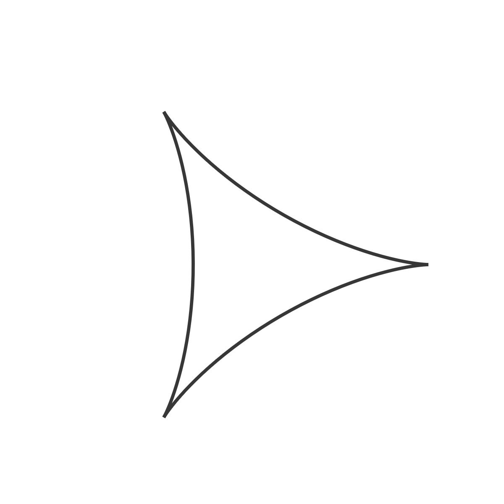

# Tear Curve

<p align="center"></p>

Code:

```JavaScript
deltoid() {
    let a = 1;
    for (let theta = 0; theta < TWO_PI; theta += 0.05) {
      let x = this.r * (4 * a * pow(cos(theta / 2), 2) * cos(theta) - a);
      let y = this.r * (4 * a * pow(sin(theta / 2), 2) * sin(theta));
      this.points.push(createVector(x, y));
    }
}
```

[Source](https://mathcurve.com/courbes2d.gb/deltoid/deltoid.shtml)

## 🌄 Gallery

<!-- IMAGE-LIST:START - Do not remove or modify this section -->
<!-- prettier-ignore-start -->
<!-- markdownlint-disable -->
<table>
  <tbody>
   <tr>
     <td align="center"><a href=""> <br /><sub><b><br/>Kolam ruleset with deltoid curve</b></sub></a></td>
     <td align="center"><a href=""> <br /><sub><b><br/>Two triangle rulesets with deltoid curve</b></sub></a></td>
    </tr>
    <tr>
     <td align="center"><a href=""> <br /><sub><b><br/>Hilbert ruleset with deltoid curve</b></sub></a></td>
    <td align="center"><a href=""> <br /><sub><b><br/>Box ruleset with deltoid curve</b></sub></a></td>
 </tbody>
</table>

<!-- markdownlint-restore -->
<!-- prettier-ignore-end -->

<!-- IMAGE-LIST:END -->
