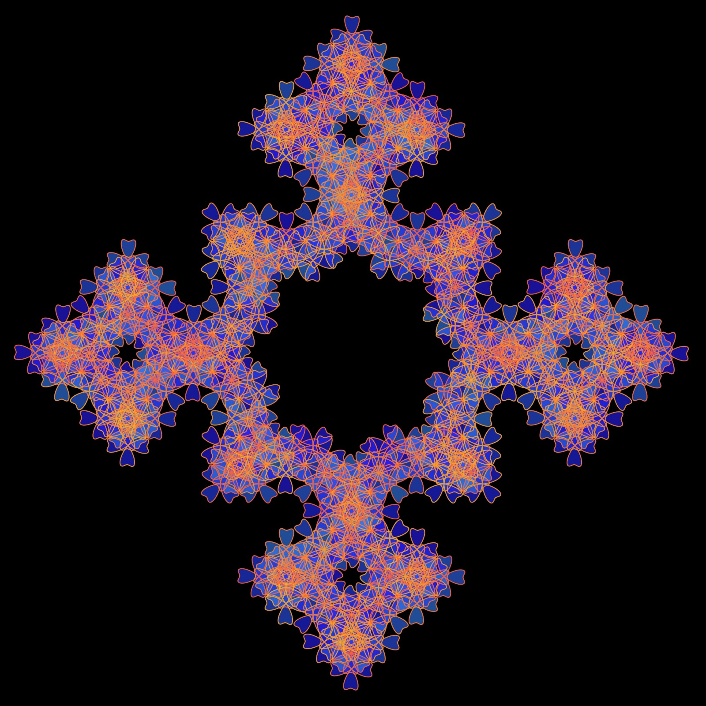
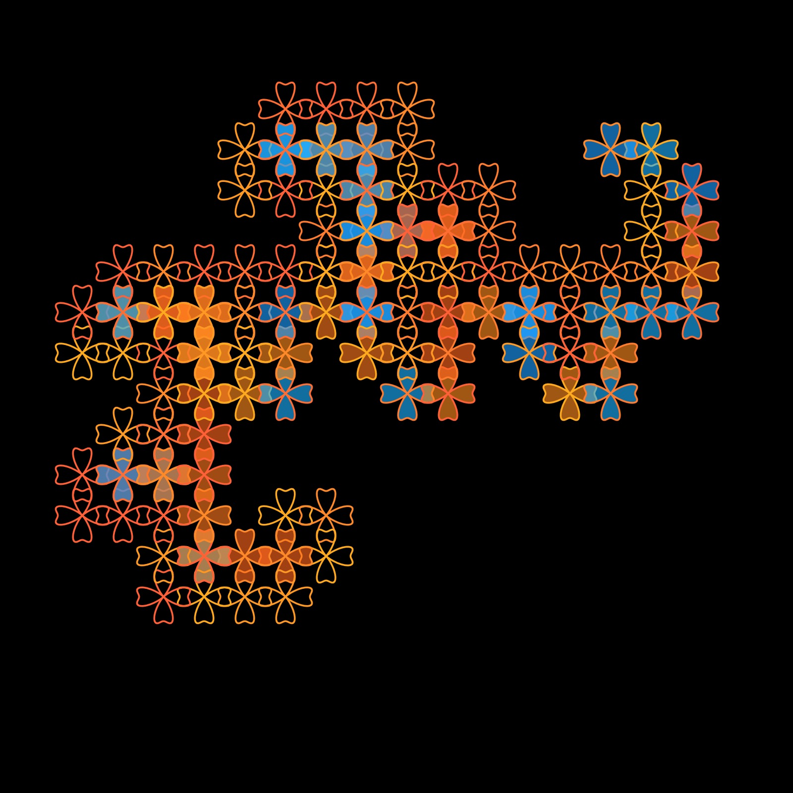
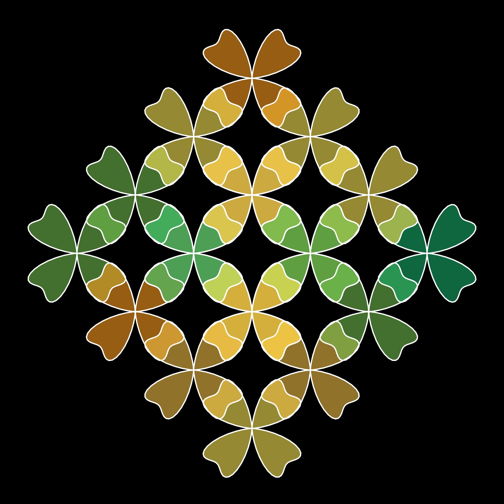

# Clover Curve

<p align="center"></p>

Code:

```JavaScript


  clover() {
    for (let theta = 0; theta < TWO_PI; theta += 0.05) {
      let r = 1 + cos(this.m * theta) + pow(sin(this.m * theta), 2);
      let x = this.r * r * cos(theta);
      let y = this.r * r * sin(theta);
      this.points.push(createVector(x, y));
    }
  }
```

Sources:
- [Mathcurve - clover curve](https://mathcurve.com/courbes2d/ornementales/ornementales.shtml)

## 🌄 Gallery

<!-- IMAGE-LIST:START - Do not remove or modify this section -->
<!-- prettier-ignore-start -->
<!-- markdownlint-disable -->
<table>
  <tbody>
   <tr>
     <td align="center"><a href=""> <br /><sub><b><br/>ADH231a ruleset with clover curve</b></sub></a></td>
     <td align="center"><a href=""> <br /><sub><b><br/>Dragon rule-set with clover curve</b></sub></a></td>
    </tr>
    <tr>
     <td align="center"><a href=""> <br /><sub><b><br/>Kolam ruleset with clover curve</b></sub></a></td>
     <td align="center"><a href=""> <br /><sub><b><br/>Hilbert curve with cornu spiral</b></sub></a></td>
    </tr>


 </tbody>
</table>

<!-- markdownlint-restore -->
<!-- prettier-ignore-end -->

<!-- IMAGE-LIST:END -->
