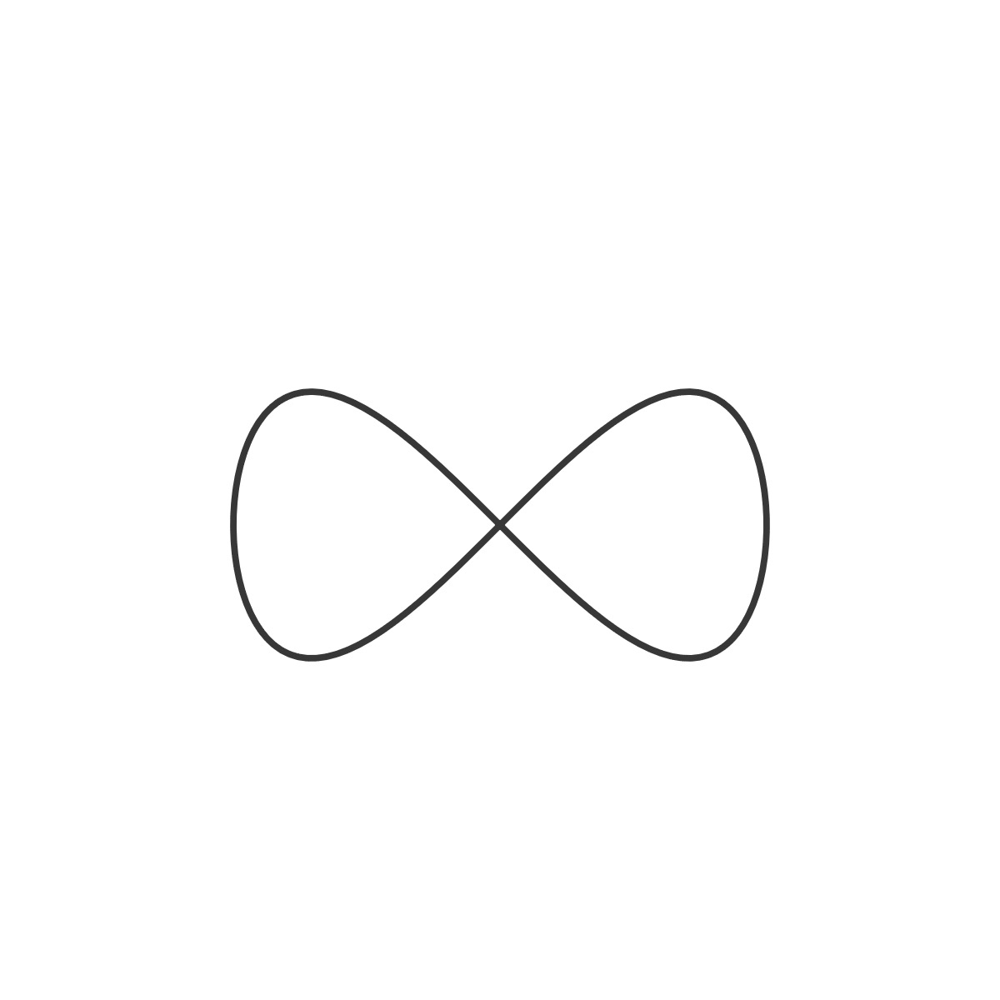
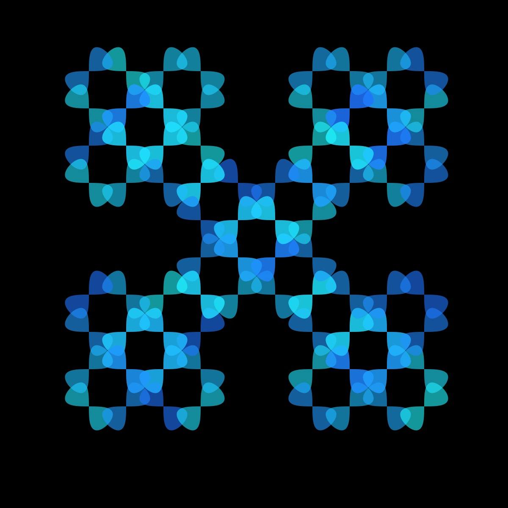

# Eight Curve

<p align="center"></p>

Code:

```JavaScript
eight() {
    let a = 1;
    for (let theta = 0; theta < TWO_PI; theta += 0.05) {
      let x = this.r * a * sin(theta);
      let y = this.r * a * sin(theta) * cos(theta);
      this.points.push(createVector(x, y));
    }
  }
```

[Source](https://mathcurve.com/courbes2d.gb/gerono/gerono.shtml)

## 🌄 Gallery

<!-- IMAGE-LIST:START - Do not remove or modify this section -->
<!-- prettier-ignore-start -->
<!-- markdownlint-disable -->
<table>
  <tbody>
   <tr>
     <td align="center"><a href=""> <br /><sub><b><br/>Rounded star ruleset with eight curve</b></sub></a></td>
     <td align="center"><a href=""> <br /><sub><b><br/>Hilbert curve with eight curve</b></sub></a></td>
    </tr>
    <tr>
     <td align="center"><a href=""> <br /><sub><b><br/>Krishna anklet with eight curve</b></sub></a></td>
    <td align="center"><a href=""> <br /><sub><b><br/>Box ruleset with eight curve</b></sub></a></td>
 </tbody>
</table>

<!-- markdownlint-restore -->
<!-- prettier-ignore-end -->

<!-- IMAGE-LIST:END -->
