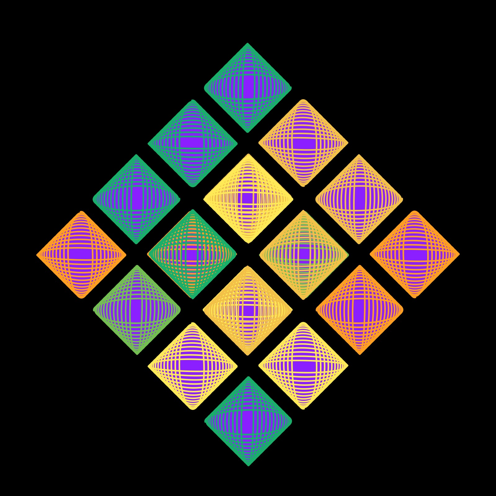

# Lissajous Curve

<p align="center"></p>

Code:

```JavaScript
lissajous() {
    for (let theta = -2 * PI; theta <= 2 * PI; theta += 0.01) {
      let x = this.r * sin(this.a * theta + this.m) + 1;
      let y = this.r * sin(this.b * theta);
      this.points.push(createVector(x, y));
    }
}
```

[Lissajous Curve Coding Challenge](https://thecodingtrain.com/challenges/116-lissajous-curve-table)


## 🌄 Gallery

<!-- IMAGE-LIST:START - Do not remove or modify this section -->
<!-- prettier-ignore-start -->
<!-- markdownlint-disable -->
<table>
  <tbody>
   <tr>
     <td align="center"><a href=""> <br /><sub><b><br/>ADH231a ruleset with lissajous curve</b></sub></a></td>
     <td align="center"><a href=""> <br /><sub><b><br/>Koch snowflake with lissajous curve</b></sub></a></td>
    </tr>
    <tr>
     <td align="center"><a href=""> <br /><sub><b><br/>Board ruleset with lissajous curve</b></sub></a></td>
    <td align="center"><a href=""> <br /><sub><b><br/>Kolam ruleset with lissajous curve</b></sub></a></td>
 </tbody>
</table>

<!-- markdownlint-restore -->
<!-- prettier-ignore-end -->

<!-- IMAGE-LIST:END -->
