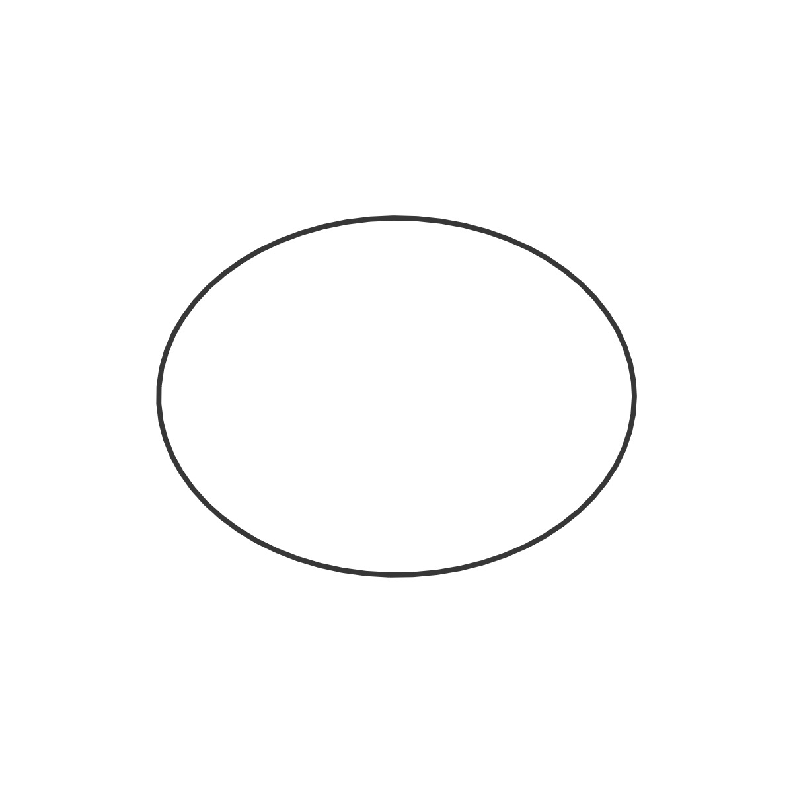

# Polar Shapes - WIP

The shape code can be found in the shapes.js file. The ShapeUI class (shape_ui.js) adds the dropdown and add a new Shape in the `selectShape(shapeName, shapeValues)` function. A switch statement to select the specific shape choosen by the user. The `selectShape()` function is called in the `addLsystem()` function is the Turtle class (turtle.js).

If you would like to learn more about polar coordinates and rendering polaring shapes, I highly recommend reading Daniel Shiffman's [The Nature of Code](https://natureofcode.com/) book or watching some  of Daniel Shiffman's tutorial videos.  You can find an p5.js sketch [here](https://kfahn22.github.io/shape_playground/) for experimenting with the shape parameters.

[Polar Coordinates - The Nature of Code](https://www.youtube.com/watch?v=O5wjXoFrau4k)

[](https://www.youtube.com/watch?v=ksRoh-10lak)

[](https://www.youtube.com/watch?v=oUBAi9xQ2X4)

## Code

Here is the code to instantiate the Shape class: 

```JavaScript
selectedShape = new Shape(
    0,
    0,
    length * shapeScale,
    a,
    b,
    m,
    n1,
    n2,
    n3,
    n,
    shapeAngle
);
```

While most of the shapes are closed, several shapes are "open" by nature. There are therefore two different functions in the Shapes class to render the shape -- a show() and an openShow(). I have also added messaging about the shape curves which appears when the shape is selected if it is a function of the shape parameters (a, b, m, n1, n2, n3, n). For example, if the supershape is selected, this message appears:

The supershape curve is a f(a, b, m, n, n1, n2, n3).

## 🌄 Shape Images

<!-- IMAGE-LIST:START - Do not remove or modify this section -->
<!-- prettier-ignore-start -->
<!-- markdownlint-disable -->
<table>
  <tbody>
   <tr>
     <td align="center"><a href="archimedes.md"> <br /><sub><b><br/>Archimedes spiral</b></sub></a></td>
     <td align="center"><a href="astroid.md"> <br /><sub><b><br/>Astroid</b></sub></a></td>
     <td align="center"><a href="bicorn.md"> <br /><sub><b><br/>Bicorn </b></sub></a></td>
     <td align="center"><a href="cassini.md"> <br /><sub><b><br/>Cassini oval</b></sub></a></td>
    </tr>
    <tr>
     <td align="center"><a href="ceva.md"> <br /><sub><b><br/>Ceva</b></sub></a></td>
     <td align="center"><a href="cornu.md"> <br /><sub><b><br/>Cornu Spiral</b></sub></a></td>
     <td align="center"><a href="cross.md"> <br /><sub><b><br/>Maltese Cross</b></sub></a></td>
     <td align="center"><a href="deltoid.md"> <br /><sub><b><br/>Deltoid</b></sub></a></td>
    </tr>
    <tr>
     <td align="center"><a href="eight.md"> <br /><sub><b><br/>Eight curve</b></sub></a></td>
     <td align="center"><a href="gear.md"> <br /><sub><b><br/>Gear curve</b></sub></a></td>
     <td align="center"><a href="heart.md"> <br /><sub><b><br/>Heart curve</b></sub></a></td>
     <td align="center"><a href="kiss.md"> <br /><sub><b><br/>Kiss curve</b></sub></a></td>
    </tr>
    <tr>
     <td align="center"><a href="quadrifolium.md"> <br /><sub><b><br/>Quadrifolium</b></sub></a></td>
     <td align="center"><a href="polygon.md"> <br /><sub><b><br/>Quadrilateral</b></sub></a></td>
     <td align="center"><a href="superellipse.md"> <br /><sub><b><br/>Superellipse</b></sub></a></td>
       <td align="center"><a href="supershape.md"> <br /><sub><b><br/>Supershape</b></sub></a></td>
    </tr>
    <tr>
     <td align="center"><a href="tear.md"> <br /><sub><b><br/>Tear</b></sub></a></td>
     </tr>
 </tbody>
</table>

<!-- markdownlint-restore -->
<!-- prettier-ignore-end -->

<!-- IMAGE-LIST:END -->