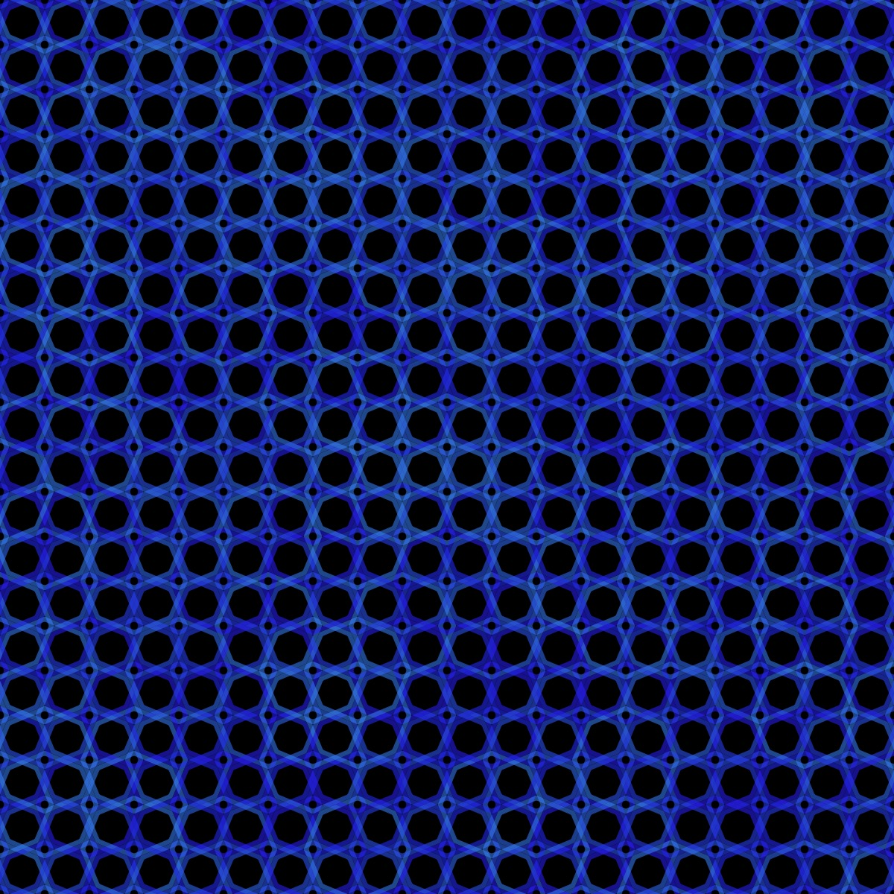

# Quadrilateral Curve

<p align="center"></p>

Code:

```JavaScript
quadrilaterial() {
    for (let theta = 0; theta < TWO_PI; theta += TWO_PI / this.m) {
      let x = this.r * cos(theta);
      let y = this.r * sin(theta);
      this.points.push(createVector(x, y));
    }
}
```

## 🌄 Gallery

<!-- IMAGE-LIST:START - Do not remove or modify this section -->
<!-- prettier-ignore-start -->
<!-- markdownlint-disable -->
<table>
  <tbody>
   <tr>
     <td align="center"><a href=""> <br /><sub><b><br/>Peano ruleset with quadrilateral curve</b></sub></a></td>
     <td align="center"><a href=""> <br /><sub><b><br/>ADH231a ruleset with quadrilateral curve</b></sub></a></td>
    </tr>
    <tr>
     <td align="center"><a href=""> <br /><sub><b><br/>Hilbert ruleset with quadrilateral curve</b></sub></a></td>
    <td align="center"><a href=""> <br /><sub><b><br/>Koch snowflake ruleset with quadrilateral curve</b></sub></a></td>
 </tbody>
</table>

<!-- markdownlint-restore -->
<!-- prettier-ignore-end -->

<!-- IMAGE-LIST:END -->
