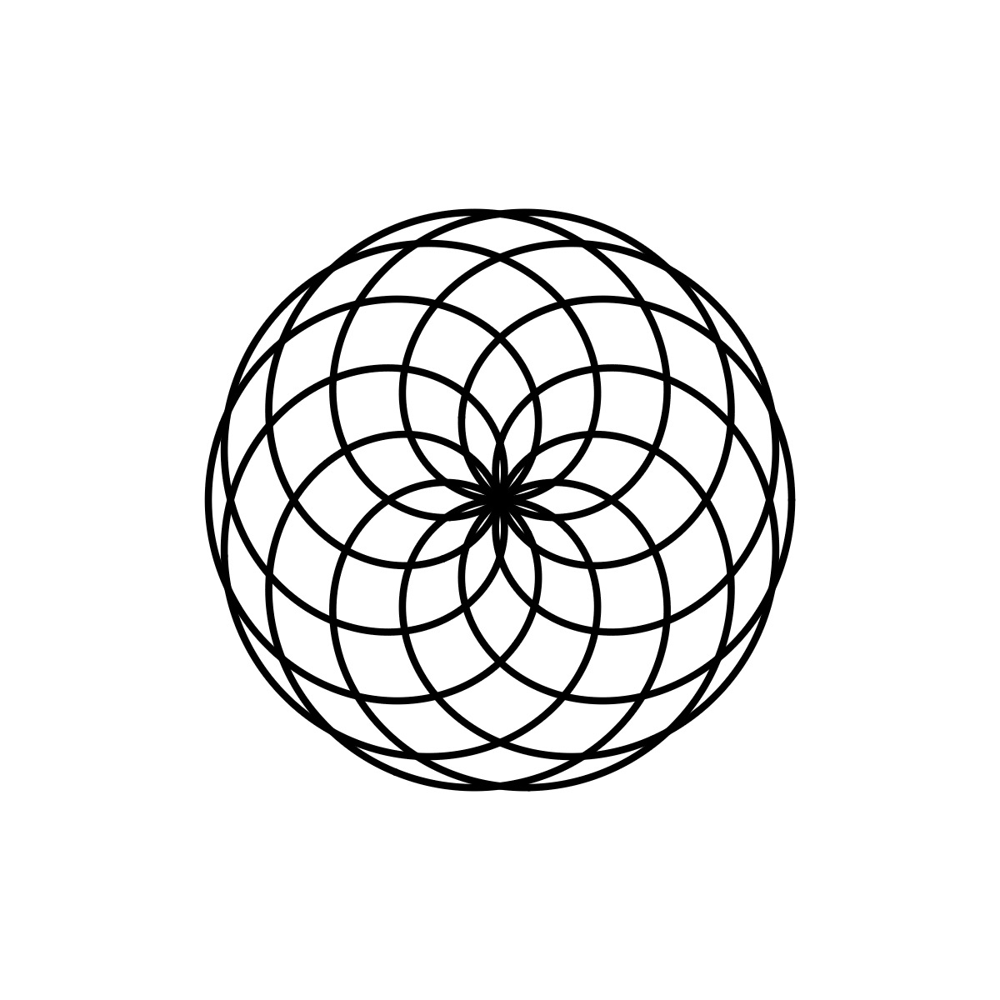

# Rose Curve

<p align="center"></p>

Code:

```JavaScript
reduceDenominator(numerator, denominator) {
    function rec(a, b) {
      return b ? rec(b, a % b) : a;
    }
    return denominator / rec(numerator, denominator);
  }

rose() {
    let k = this.d / this.m;
    for (
      let theta = 0;
      theta < TWO_PI * this.reduceDenominator(this.d, this.m);
      theta += 0.02
    ) {
      let r = this.r * cos(k * theta);
      let x = r * cos(theta);
      let y = r * sin(theta);
      this.points.push(createVector(x, y));
    }
}
```

- [Mathematical Rose Coding Challenge](https://thecodingtrain.com/challenges/55-mathematical-rose-patterns) 
- [Rose](https://mathcurve.com/courbes2d.gb/rosace/rosace.shtml)

## 🌄 Gallery

<!-- IMAGE-LIST:START - Do not remove or modify this section -->
<!-- prettier-ignore-start -->
<!-- markdownlint-disable -->
<table>
  <tbody>
   <tr>
     <td align="center"><a href=""> <br /><sub><b><br/>Mango leaf ruleset with rose curve</b></sub></a></td>
     <td align="center"><a href=""> <br /><sub><b><br/>ADH231a ruleset with rose curve</b></sub></a></td>
    </tr>
    <tr>
     <td align="center"><a href=""> <br /><sub><b><br/>Quadratic snowflake ruleset with rose curve</b></sub></a></td>
     <td align="center"><a href=""> <br /><sub><b><br/>Skierpinski carpet rule-set with rose curve</b></sub></a></td>
    </tr>
    
  
    
 </tbody>
</table>

<!-- markdownlint-restore -->
<!-- prettier-ignore-end -->

<!-- IMAGE-LIST:END -->
