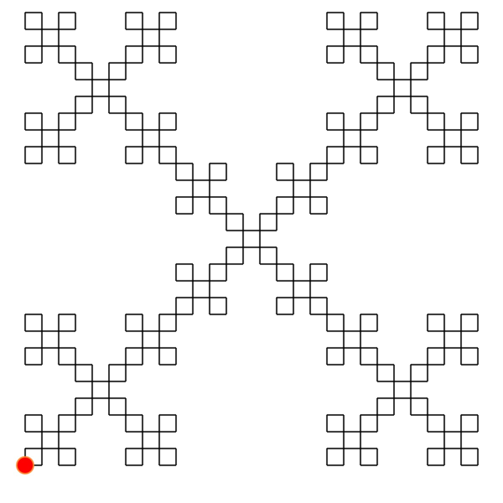
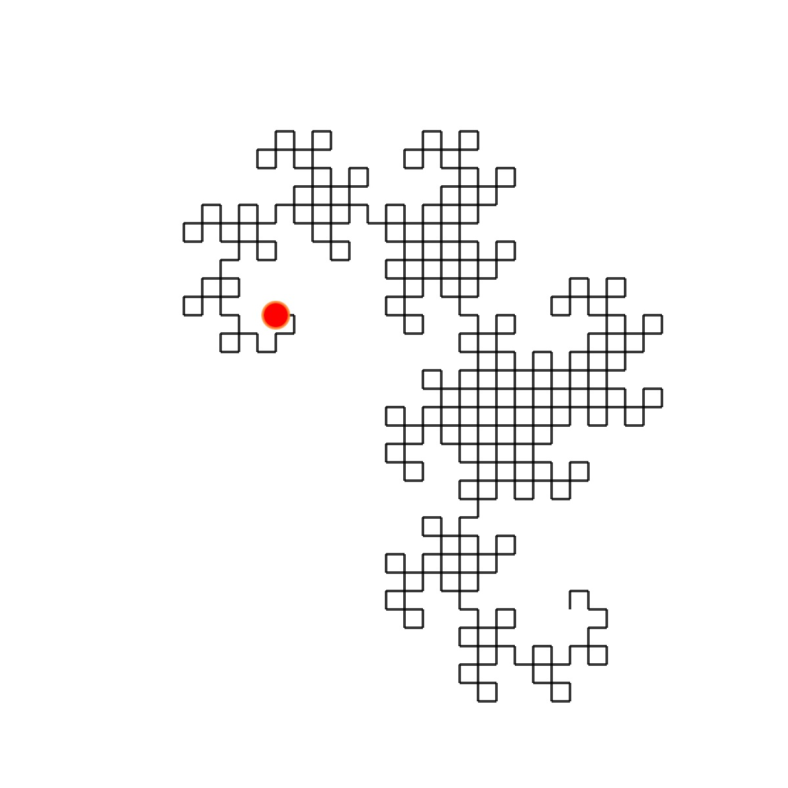
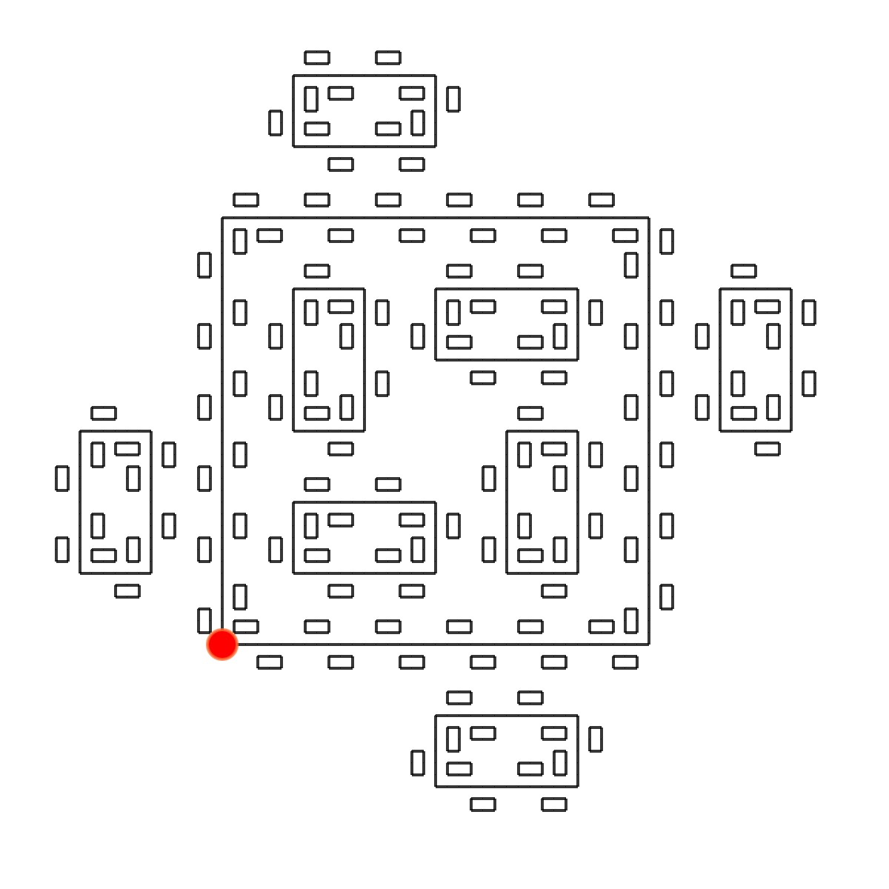
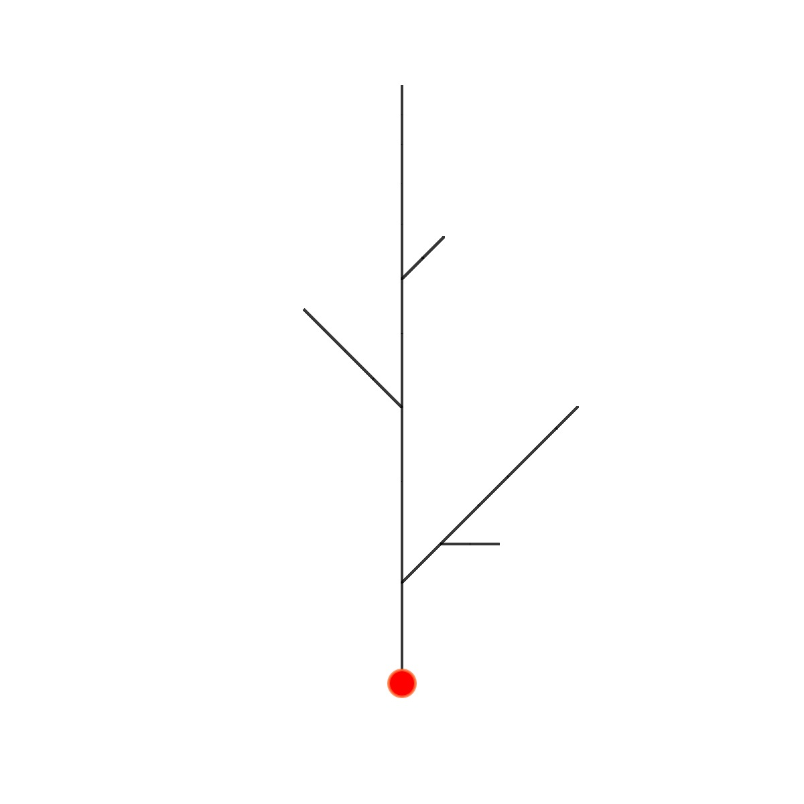
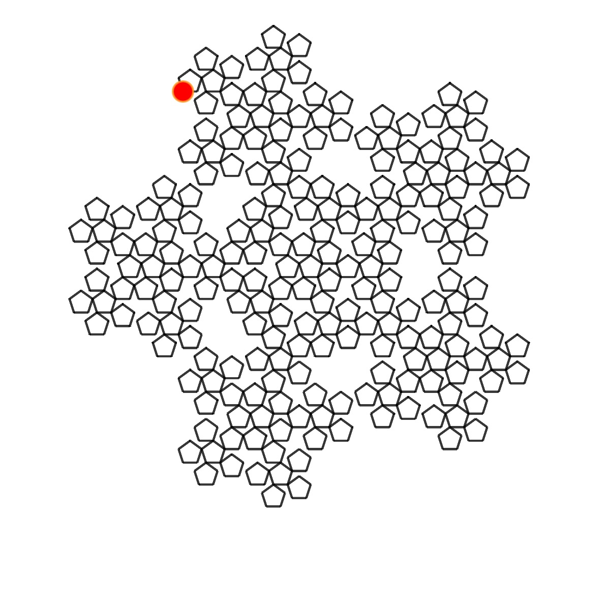
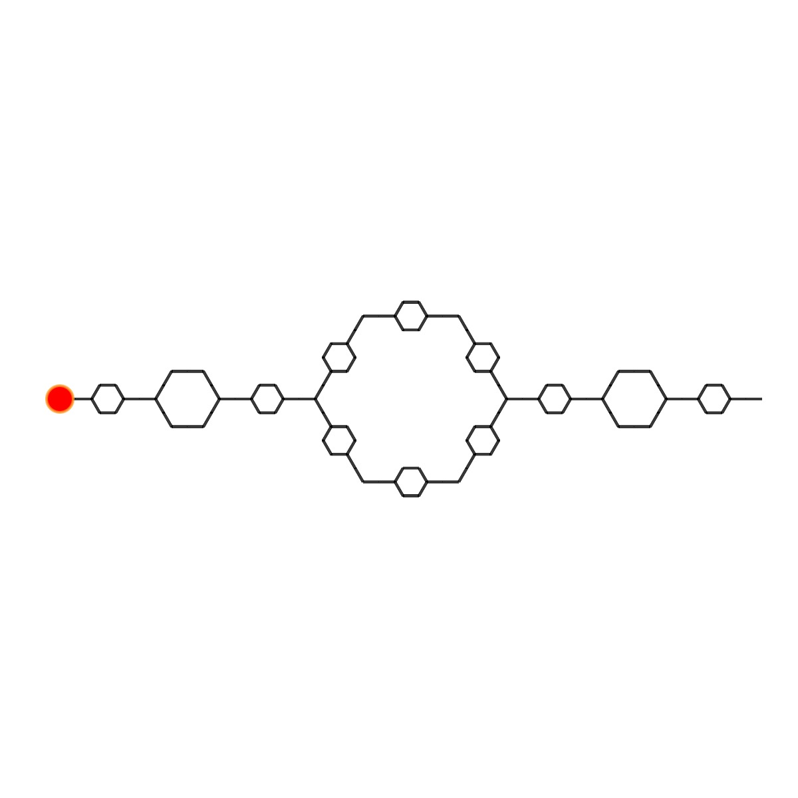
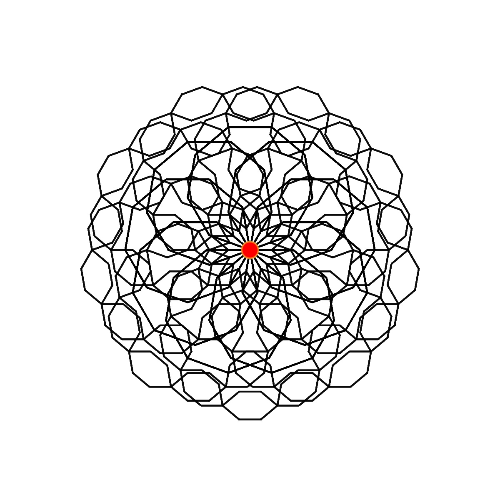
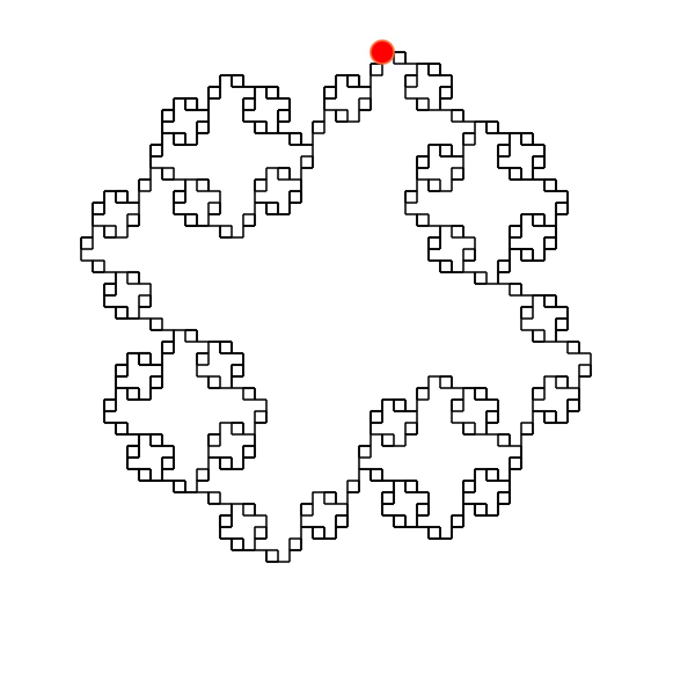
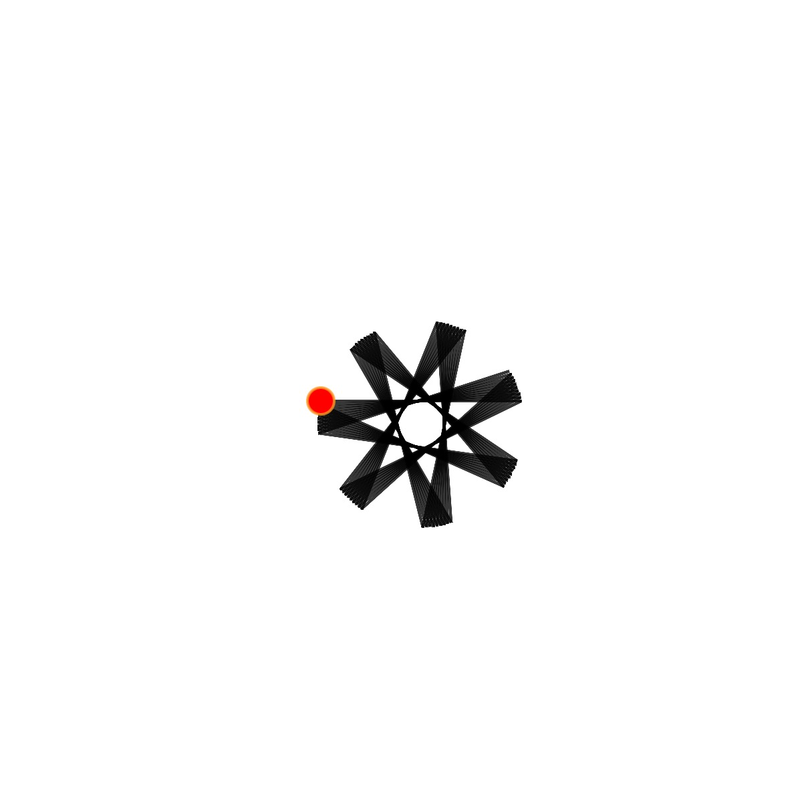

# The L-system Rule-sets

The rulesets can be found in the rules.json file. The majority of the rule-sets were written by [Paul Bourke](https://paulbourke.net/fractals/lsys/). I found another very nice resource on rulesets by Dmytro Fedoriaka [here](https://fedimser.github.io/l-systems.html). When known, I have added the author as part of the data in the json file.

If you would like to learn more about L-Systems, I highly recommend Daniel Shiffman's [The Nature of Code](https://natureofcode.com/) book or his Coding Challenge on L-system fractal trees.

## Important Notes

I was having an issue with the sketch freezing with certain fractal patterns, so I imposed some (somewhat arbitrary) contraints on the fractal level. I have added alerts when the level is above the maxLevel I have set for the ruleset, and it is automatically constrained at the maxLevel. Of course, the maxLevel field can be edited as desired.

The fractals start at different points on the canvas, and therefore need different translations. The images below show the L-systems with the starting point indicated by the red circle. If you switch fractals and don't see anything, it is most likely because the fractal needs to be translated in either the x or y direction.

By default, two L-systems are rendered. You can remove the second one by checking the "Remove ruleset" check-box.

## 🌄 Rule-set Images

<!-- IMAGE-LIST:START - Do not remove or modify this section -->
<!-- prettier-ignore-start -->
<!-- markdownlint-disable -->
<table>
  <tbody>
   <tr>
     <td align="center"><a href="Rule-set-examples/ADH231a.md">  <b> ADH231a Rule-set</b></a></td>
     <td align="center"><a href="Rule-set-examples/ADH256a.md">  <b> ADH256a Rule-set</b></a></td>
     <td align="center"><a href="Rule-set-examples/board.md">  <b> Board rule-set</b></a></td>
     <td align="center"><a href="Rule-set-examples/box.md">  <b> Box Rule-set</b></a></td>
    </tr>
    <tr>
     <td align="center"><a href="Rule-set-examples/cross.md">  <b> Cross Rule-set</b></a></td>
     <td align="center"><a href="Rule-set-examples/doily.md">  <b> Doily Rule-set</b></a></td>
     <td align="center"><a href="Rule-set-examples/dragon.md">  <b> Dragon rule-set</b></a></td>
     <td align="center"><a href="">  <b> Fern Rule-set</b></a></td>
    </tr>
    <tr>
     <td align="center"><a href="">  <b> Fern2 Rule-set</b></a></td>
     <td align="center"><a href="">  <b> Fern3 Rule-set</b></a></td>
     <td align="center"><a href="Rule-set-examples/hillbert.md">  <b> Hilbert rule-set</b></a></td>
     <td align="center"><a href="Rule-set-examples/island.md">  <b> Island Rule-set</b></a></td>
    </tr>
    <tr>
     <td align="center"><a href="Rule-set-examples/koch_curve.md">  <b> Koch curve Rule-set</b></a></td>
     <td align="center"><a href="Rule-set-examples/koch_snowflake.md">  <b> Koch snowflake Rule-set</b></a></td>
     <td align="center"><a href="Rule-set-examples/kolam.md">  <b> Kolam  rule-set</b></a></td>
     <td align="center"><a href="">  <b> Leaf Rule-set</b></a></td>
    </tr>
    <tr>
     <td align="center"><a href="Rule-set-examples/levy.md">  <b> Levy curve Rule-set</b></a></td>
     <td align="center"><a href="Rule-set-examples/mango-leaf.md">  <b> Mango leaf Rule-set</b></a></td>
     <td align="center"><a href="">  <b> Peano-c  rule-set</b></a></td>
     <td align="center"><a href="Rule-set-examples/peano.md">  <b> Peano Rule-set</b></a></td>
    </tr>
    <tr>
     <td align="center"><a href="Rule-set-examples/pentadentrite.md">  <b> Pentadentrite curve Rule-set</b></a></td>
     <td align="center"><a href="">  <b> Pentigree Rule-set</b></a></td>
     <td align="center"><a href="Rule-set-examples/pentaplexity.md">  <b> Pentaplexity Rule-set</b></a></td>
     <td align="center"><a href="Rule-set-examples/quadratic_gosper.md">  <b> Quadratic Gosper Rule-set</b></a></td>
    </tr>
     <tr>
     <td align="center"><a href="Rule-set-examples/quadratic_koch_island.md">  <b> Quadratic koch island Rule-set</b></a></td>
     <td align="center"><a href="Rule-set-examples/quadratic_snowflake.md">  <b> Quadratic Snowflake Rule-set</b></a></td>
     <td align="center"><a href="">  <b> Recursive circles Rule-set</b></a></td>
     <td align="center"><a href="">  <b> Recursive circles 2 Rule-set</b></a></td>
    </tr>
     <tr>
     <td align="center"><a href="Rule-set-examples/rings.md">  <b> Rings Rule-set</b></a></td>
     <td align="center"><a href="Rule-set-examples/rounded-star.md">  <b> Rounded Star Rule-set</b></a></td>
     <td align="center"><a href="Rule-set-examples/skierpinski-carpet.md">  <b> Skierpinski carpet Rule-set</b></a></td>
     <td align="center"><a href="Rule-set-examples/skierpinski.md">  <b> Skierpinski  Rule-set</b></a></td>
    </tr>
     <tr>
     <td align="center"><a href="Rule-set-examples/snake-kolam.md">  <b> Snake kolam Rule-set</b></a></td>
     <td align="center"><a href="Rule-set-examples/square-skierpinski.md">  <b> Square skeirpinski Rule-set Rule-set</b></a></td>
     <td align="center"><a href="">  <b> Sticks  Rule-set</b></a></td>
     <td align="center"><a href="Rule-set-examples/tiles.md">  <b> Tiles  Rule-set</b></a></td>
    </tr>
     <tr>
     <td align="center"><a href="">  <b> Torn Square Rule-set</b></a></td>
     <td align="center"><a href="">  <b> Tree Rule-set</b></a></td>
     <td align="center"><a href="">  <b> Triangles Rule-set</b></a></td>
    </tr>
 </tbody>
</table>

<!-- markdownlint-restore -->
<!-- prettier-ignore-end -->

<!-- IMAGE-LIST:END -->