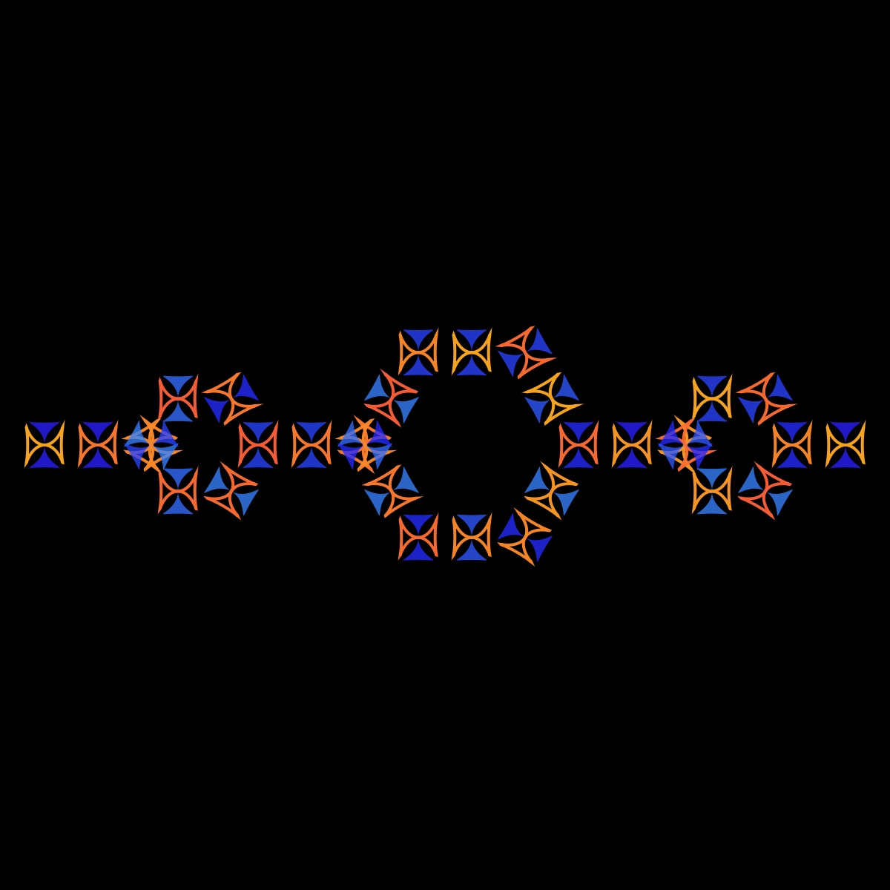

# Recursive Circles Ruleset

<p align="center"></p>

Ruleset

```JSON
  "recursive_circles": {
    "axiom": "F",
    "rules": {
      "F": "FXF",
      "X": "[-F+F+F]+F-F-F+"
    },
    "angle": "60",
    "length_factor": "1",
    "max_Level": "5",
    "author": ""
}
```

## 🌄 Gallery

<!-- IMAGE-LIST:START - Do not remove or modify this section -->
<!-- prettier-ignore-start -->
<!-- markdownlint-disable -->
<table>
  <tbody>
    <tr>
     <td align="center"><a href=""> <br /><sub><b><br/></b></sub></a></td>
     <td align="center"><a href=""> <br /><sub><b><br/></b></sub></a></td>
    </tr>
    <tr>
     <td align="center"><a href=""> <br /><sub><b><br/></b></sub></a></td>
     <td align="center"><a href=""> <br /><sub><b><br/></b></sub></a></td>
</tr>
 
 </tbody>
</table>

<!-- markdownlint-restore -->
<!-- prettier-ignore-end -->

<!-- IMAGE-LIST:END -->
