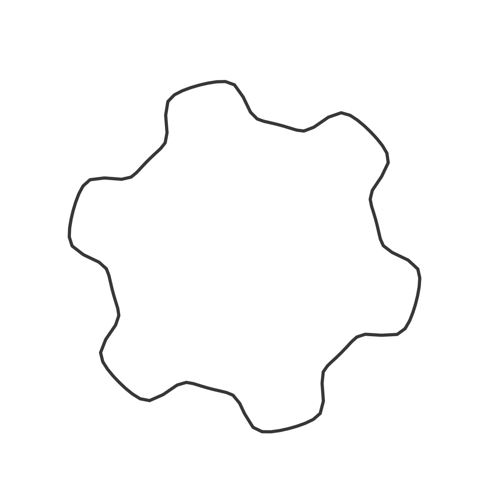
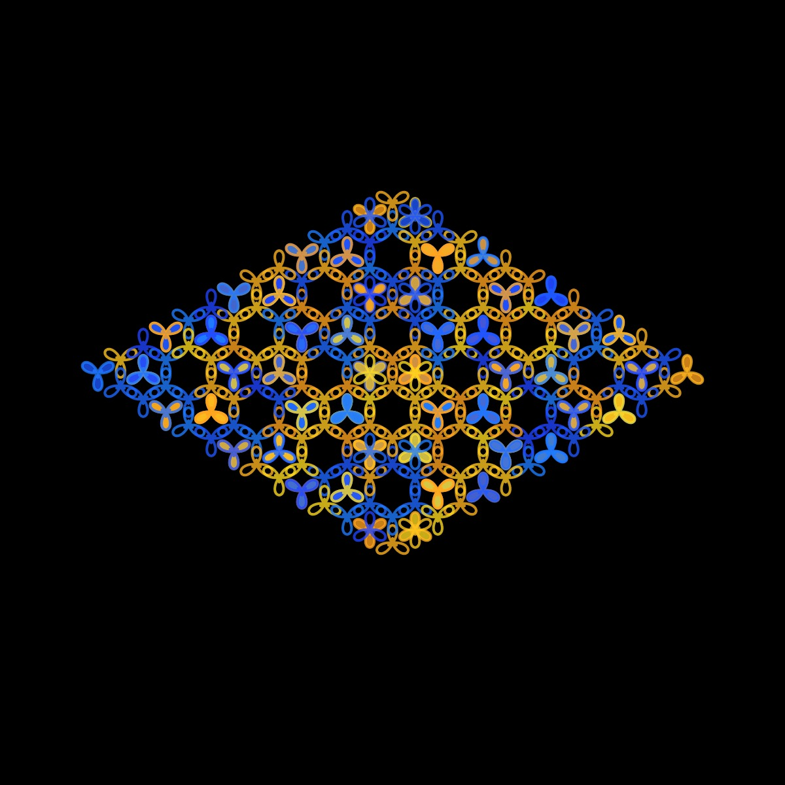

# Gear Curve

<p align="center"></p>

Code:

```JavaScript
hyperbolicTan(theta) {
    let l = pow(e, 2 * theta);
    return (l - 1) / (l + 1);
}

gear() {
    for (let theta = 0; theta < 2 * PI; theta += 0.05) {
      let r =
        this.a +
        (1 / this.b) * this.hyperbolicTan(this.b * sin(this.m * theta));
      let x = this.r * r * sin(theta);
      let y = this.r * r * cos(theta);
      this.points.push(createVector(x, y));
    }
}
```

Sources:

-[Mathworld - Gear Curve](https://mathworld.wolfram.com/GearCurve.html)
-[Hyperbolic tan function](https://help.tc2000.com/m/69445/l/755460-hyperbolic-functions-table)

## 🌄 Gallery

<!-- IMAGE-LIST:START - Do not remove or modify this section -->
<!-- prettier-ignore-start -->
<!-- markdownlint-disable -->
<table>
  <tbody>
   <tr>
     <td align="center"><a href=""> <br /><sub><b><br/>Krishna anklet with gear curve</b></sub></a></td>
     <td align="center"><a href=""> <br /><sub><b><br/>Circular with gear curve</b></sub></a></td>
    </tr>
    <tr>
     <td align="center"><a href=""> <br /><sub><b><br/>Mango leaf with gear curve</b></sub></a></td>
     <td align="center"><a href=""> <br /><sub><b><br/>Recursive circles 2 with gear curve</b></sub></a></td>
    </tr>
 </tbody>
</table>

<!-- markdownlint-restore -->
<!-- prettier-ignore-end -->

<!-- IMAGE-LIST:END -->