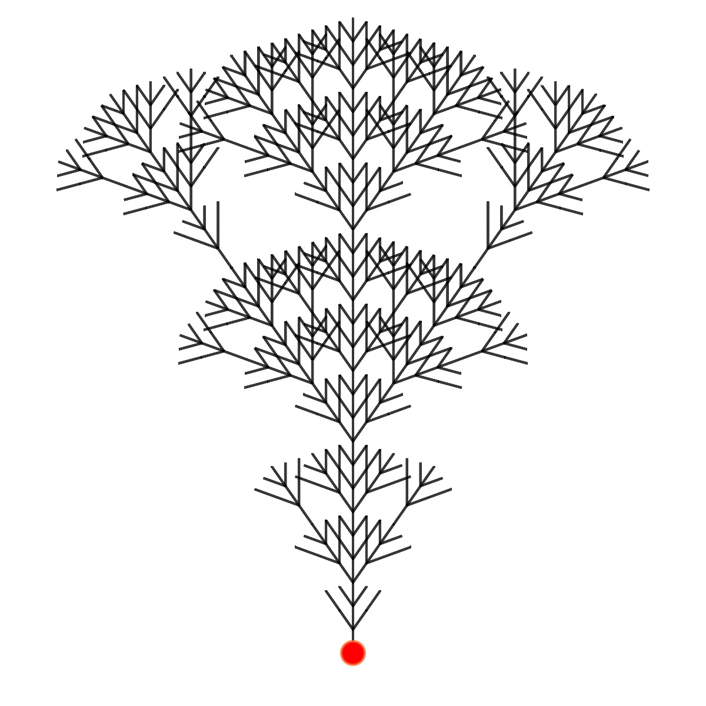
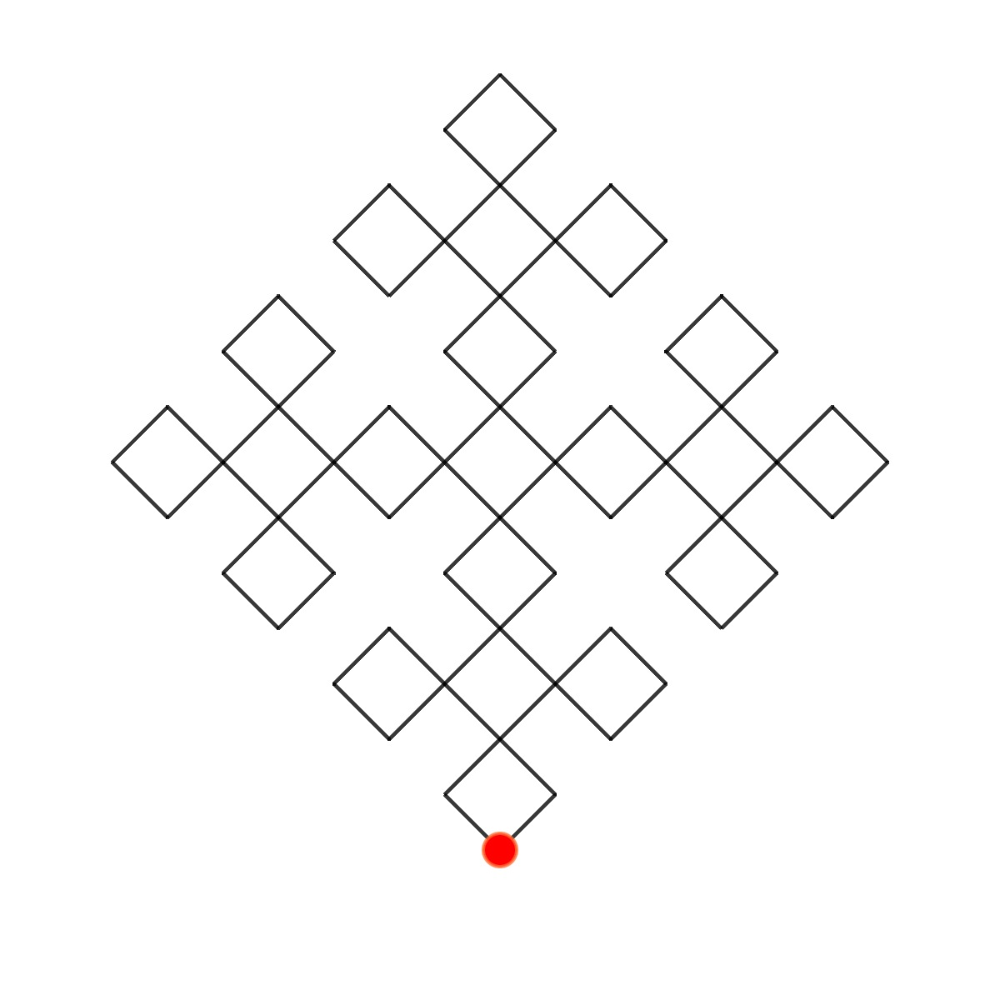
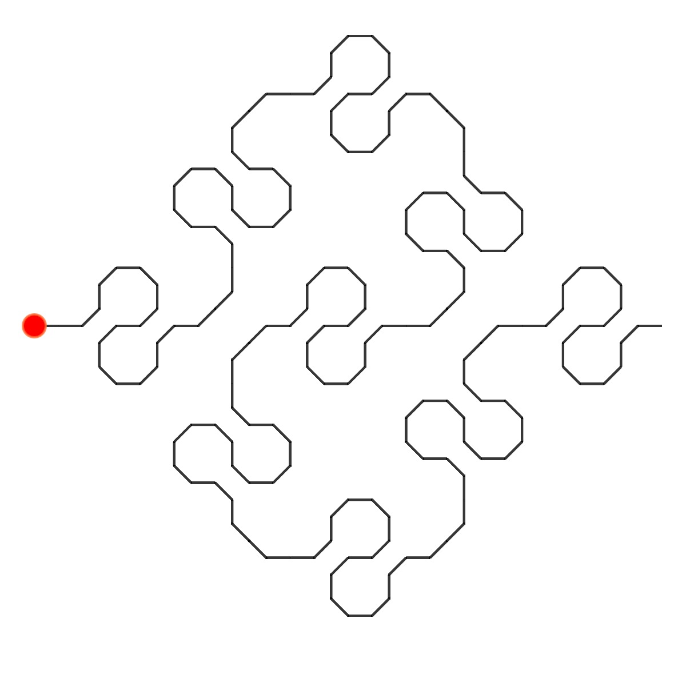
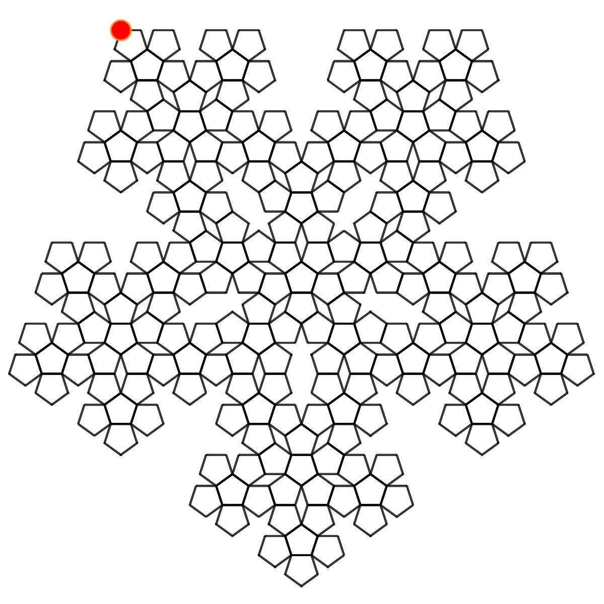
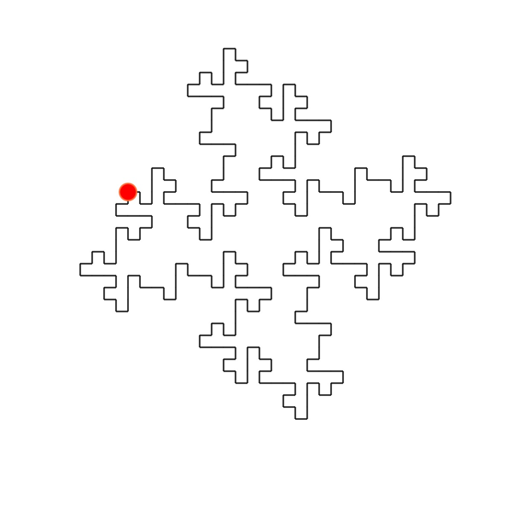
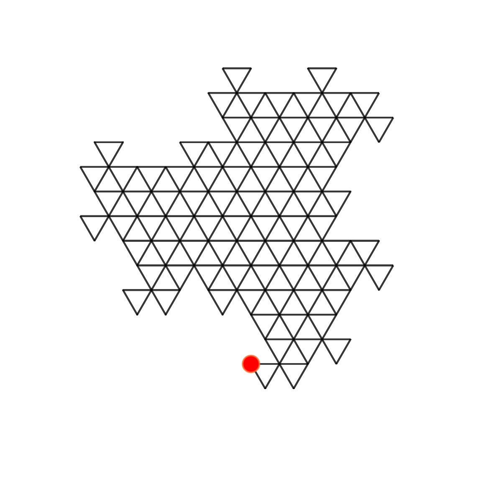
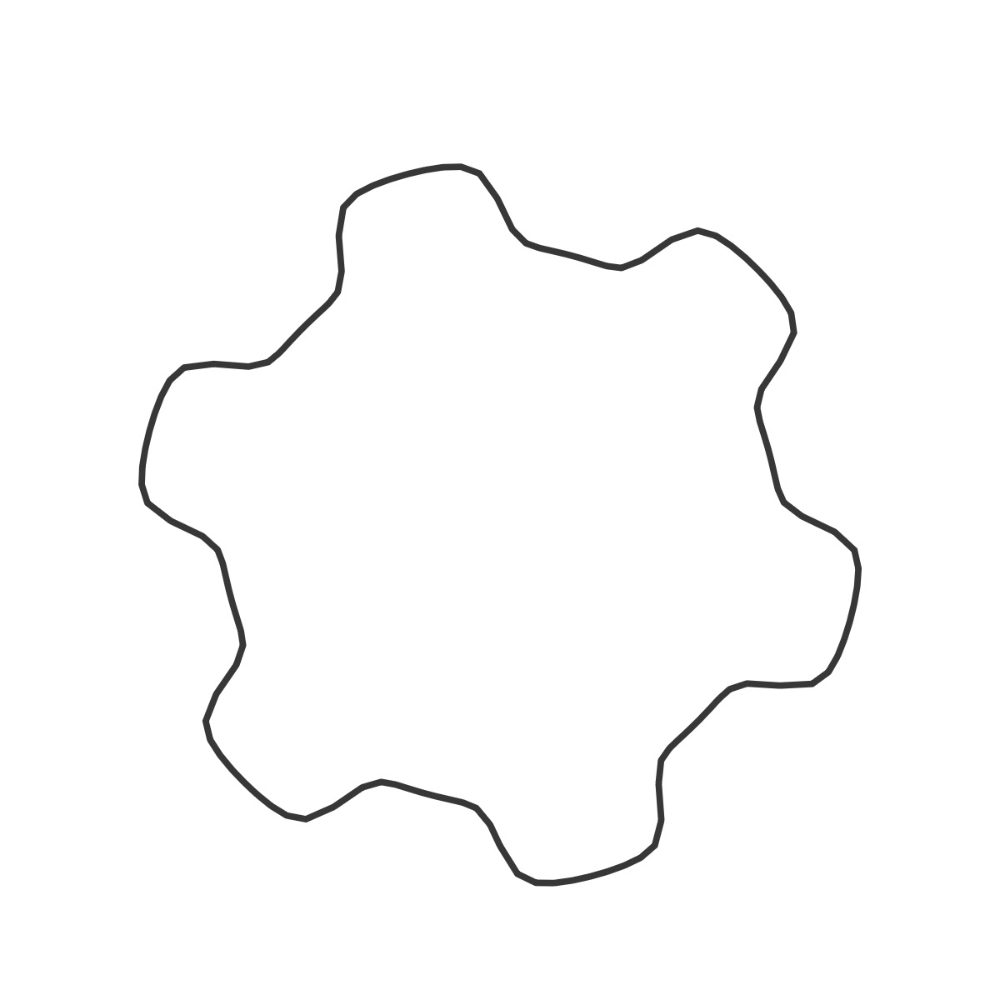

# Instructions - WIP

There are multiple sliders and three sets of dropdowns for each visualization. (While the majority of the rule-sets render fractals, a few just render multiple copies of the shape in interesting ways.)

This code as the sliders for the first L-system, setting the translation, fractal level to 5, the grid length to 20, strokeweight to 2, alpha to 145, of the scale of the shape to 1/2 of the grid size. The L-system rotation are both set to zero. The remaining numbers are the shape parameters.

`[sliders0, sliderLabels0] = addSliders(
    10,
    "first",
    0.0,
    1.0,
    5,
    20,
    2,
    145,
    0.5,
    0,
    0,
    1.5,
    2.5,
    6,
    1,
    1,
    1,
    1
  );`

The next lines add the three dropdowns for the first L-system, setting the Hilbert curve as the fractal, the gear curve as the shape, and the color palette to raspberry.

`ruleDropdown0 = addRuleDropdown(x, 5, "hilbert");`  
 `shapeDropdown0 = addShapesDropdown(x, 50, "gear");`  
 `paletteDropdown0 = addPalettes(x, 95, "raspberry");`

## The Rule-sets

The rulesets can be found in the rules.json file. The majority of the rule-sets were written by Paule Bourke. When known, I have added the author as part of the data in the json file. Another thing to note is that I was having an issue with the sketch freezing with certain fractal patterns, so I imposed some (somewhat arbitrary) contraints on the fractal level. I have added alerts when the level is above the maxLevel I have set for the ruleset, and it is automatically constrained at the maxLevel. Of course, the maxLevel field can be edited as desired.

The fractals start at different points on the canvas, and therefore need different translations. The images below show the L-systems with the starting point indicated by the red circle. If you switch fractals and don't see anything, it is most likely because the fractal needs to be translated in either the x or y direction.

By default, two L-systems are rendered. You can remove the second one by checking the "Delete L-system 2" check-box.

## 🌄 Rule-set Images

<!-- IMAGE-LIST:START - Do not remove or modify this section -->
<!-- prettier-ignore-start -->
<!-- markdownlint-disable -->
<table>
  <tbody>
   <tr>
     <td align="center"><a href="Rule-set-examples/ADH231a.md">  <b> ADH231a Rule-set</b></a></td>
     <td align="center"><a href="">  <b> ADH256a Rule-set</b></a></td>
     <td align="center"><a href="Rule-set-examples/board.md">  <b> Board rule-set</b></a></td>
     <td align="center"><a href="Rule-set-examples/box.md">  <b> Box Rule-set</b></a></td>
    </tr>
    <tr>
     <td align="center"><a href="Rule-set-examples/cross.md">  <b> Cross Rule-set</b></a></td>
     <td align="center"><a href="Rule-set-examples/doily.md">  <b> Doily Rule-set</b></a></td>
     <td align="center"><a href="Rule-set-examples/dragon.md">  <b> Dragon rule-set</b></a></td>
     <td align="center"><a href="">  <b> Fern Rule-set</b></a></td>
    </tr>
    <tr>
     <td align="center"><a href="">  <b> Fern2 Rule-set</b></a></td>
     <td align="center"><a href="">  <b> Fern3 Rule-set</b></a></td>
     <td align="center"><a href="Rule-set-examples/hillbert.md">  <b> Hilbert rule-set</b></a></td>
     <td align="center"><a href="Rule-set-examples/island.md">  <b> Island Rule-set</b></a></td>
    </tr>
    <tr>
     <td align="center"><a href="Rule-set-examples/koch_curve.md">  <b> Koch curve Rule-set</b></a></td>
     <td align="center"><a href="Rule-set-examples/koch_snowflake.md">  <b> Koch snowflake Rule-set</b></a></td>
     <td align="center"><a href="Rule-set-examples/kolam.md">  <b> Kolam  rule-set</b></a></td>
     <td align="center"><a href="">  <b> Leaf Rule-set</b></a></td>
    </tr>
    <tr>
     <td align="center"><a href="Rule-set-examples/levy.md">  <b> Levy curve Rule-set</b></a></td>
     <td align="center"><a href="Rule-set-examples/mango-leaf.md">  <b> Mango leaf Rule-set</b></a></td>
     <td align="center"><a href="Rule-set-examples/peano.md">  <b> Peano-c  rule-set</b></a></td>
     <td align="center"><a href="">  <b> Peano Rule-set</b></a></td>
    </tr>
    <tr>
     <td align="center"><a href="Rule-set-examples/pentadentrite.md">  <b> Pentadentrite curve Rule-set</b></a></td>
     <td align="center"><a href="">  <b> Pentigree Rule-set</b></a></td>
     <td align="center"><a href="Rule-set-examples/pentaplexity.md">  <b> Pentaplexity Rule-set</b></a></td>
     <td align="center"><a href="Rule-set-examples/quadratic_gosper.md">  <b> Quadratic Gosper Rule-set</b></a></td>
    </tr>
     <tr>
     <td align="center"><a href="Rule-set-examples/quadratic_koch_island.md">  <b> Quadratic koch island Rule-set</b></a></td>
     <td align="center"><a href="">  <b> Quadratic Snowflake Rule-set</b></a></td>
     <td align="center"><a href="">  <b> Recursive circles Rule-set</b></a></td>
     <td align="center"><a href="">  <b> Recursive circles 2 Rule-set</b></a></td>
    </tr>
     <tr>
     <td align="center"><a href="Rule-set-examples/rings.md">  <b> Rings Rule-set</b></a></td>
     <td align="center"><a href="Rule-set-examples/rounded-star.md">  <b> Rounded Star Rule-set</b></a></td>
     <td align="center"><a href="Rule-set-examples/skierpinski-carpet.md">  <b> Skierpinski carpet Rule-set</b></a></td>
     <td align="center"><a href="Rule-set-examples/skierpinski.md">  <b> Skierpinski  Rule-set</b></a></td>
    </tr>
     <tr>
     <td align="center"><a href="Rule-set-examples/snake-kolam.md">  <b> Snake kolam Rule-set</b></a></td>
     <td align="center"><a href="Rule-set-examples/square-skierpinski.md">  <b> Square skeirpinski Rule-set Rule-set</b></a></td>
     <td align="center"><a href="">  <b> Sticks  Rule-set</b></a></td>
     <td align="center"><a href="">  <b> Tiles  Rule-set</b></a></td>
    </tr>
     <tr>
     <td align="center"><a href="">  <b> Torn Square Rule-set</b></a></td>
     <td align="center"><a href="">  <b> Tree Rule-set</b></a></td>
     <td align="center"><a href="">  <b> Triangles Rule-set</b></a></td>
    </tr>
 </tbody>
</table>

<!-- markdownlint-restore -->
<!-- prettier-ignore-end -->

<!-- IMAGE-LIST:END -->

## Shapes

The shape code can be found in the shapes.js file. While most of the shapes are closed, the spirals are by nature "open." There are therefore two different functions in the Shapes class to render the shape -- a show() and an openShow(). I have also added messaging about the shape curves which appears when the shape is selected if it is a function of the shape parameters (a, b, m, n, n1, n2, n3). For example, if the supershape is selected, this message appears:

The supershape curve is a f(a, b, m, n, n1, n2, n3).

## 🌄 Shape Images

<!-- IMAGE-LIST:START - Do not remove or modify this section -->
<!-- prettier-ignore-start -->
<!-- markdownlint-disable -->
<table>
  <tbody>
   <tr>
     <td align="center"><a href="">  <b> Archimedes spiral</b></a></td>
     <td align="center"><a href="">  <b> Astroid</b></a></td>
     <td align="center"><a href="">  <b> Bicorn </b></a></td>
     <td align="center"><a href="">  <b> Cassini oval</b></a></td>
    </tr>
    <tr>
     <td align="center"><a href="">  <b> Ceva</b></a></td>
     <td align="center"><a href="">  <b> Cornu Spiral</b></a></td>
     <td align="center"><a href="">  <b> Maltese Cross</b></a></td>
     <td align="center"><a href="">  <b> Deltoid</b></a></td>
    </tr>
    <tr>
     <td align="center"><a href="">  <b> Eight curve</b></a></td>
     <td align="center"><a href="">  <b> Gear curve</b></a></td>
     <td align="center"><a href="">  <b> Heart curve</b></a></td>
     <td align="center"><a href="">  <b> Kiss curve</b></a></td>
    </tr>
    <tr>
     <td align="center"><a href="">  <b> Quadrifolium</b></a></td>
     <td align="center"><a href="">  <b> Quadrilateral</b></a></td>
     <td align="center"><a href="">  <b> Superellipse</b></a></td>
       <td align="center"><a href="">  <b> Supershape</b></a></td>
    </tr>
    <tr>
     <td align="center"><a href="">  <b> Tear</b></a></td>
     </tr>
 </tbody>
</table>

<!-- markdownlint-restore -->
<!-- prettier-ignore-end -->

<!-- IMAGE-LIST:END -->

There are a larger number of shapes in the Update_Lsystem_expanded file.

## Palettes

I have utiliized [https://supercolorpalette.com](supercolorpalette) to add the color palettes. For consistency, I have added two "dummy" palettes with white and black, as well as a gray palette. You can easily add more palettes by using the the supercolorpalette generator. Once you are happy with your colors, copy the url, and add it to the code in the selectPalette function (line 344). Remember to add the name of the color to the addPalettes dropdown or it will not appear in the paletteDropdown.

## Tips

- The Hilbert and Peano curve rule-sets have generated the best backgrounds for me. I have found it generally best to stick to simple color palettes and use a fill with a lower alpha. My favorite backgrounds are created with the gear curve and supershape.

- One downside of creating a generic shape class is that the parameters are not, in general, optimized for specific shapes. If you choose a shape and the scale is completely off, try editing either the shapeScale or the shape parameters. The ones to try first are a and b.

- If you choose the line and have fill checked, nothing will appear.
