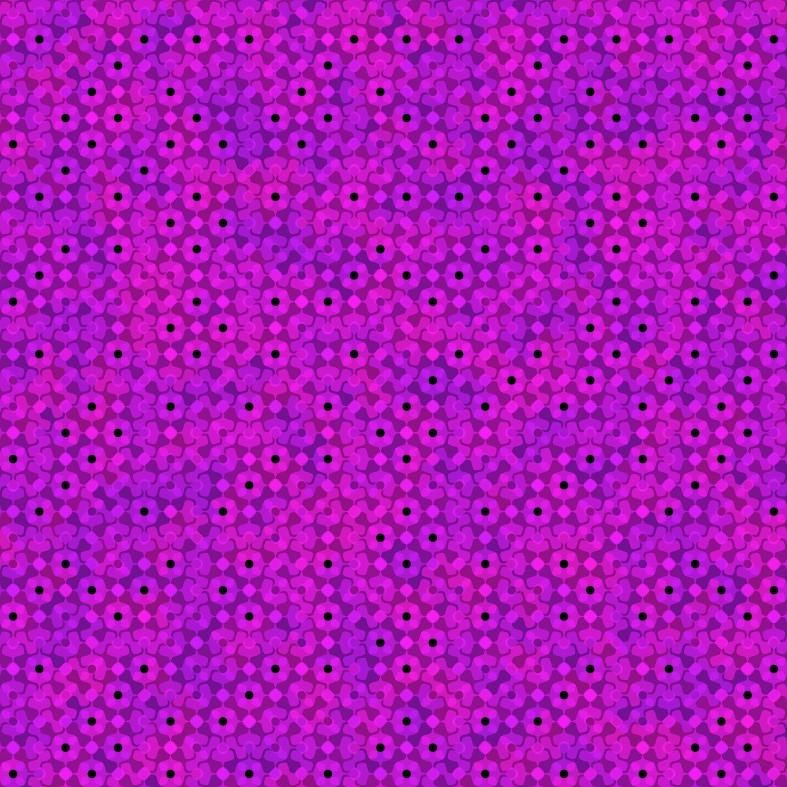

# Instructions - WIP

There are multiple sliders and three sets of dropdowns for each visualization. (While the majority of the rule-sets render fractals, a few just render multiple copies of the shape in interesting ways.)

This code as the sliders for the first L-system, setting the translation, fractal level to 5, the grid length to 20, strokeweight to 2, alpha to 145, of the scale of the shape to 1/2 of the grid size. The L-system rotation are both set to zero. The remaining numbers are the shape parameters.

`[sliders0, sliderLabels0] = addSliders(
    10,
    "first",
    0.0,
    1.0,
    5,
    20,
    2,
    145,
    0.5,
    0,
    0,
    1.5,
    2.5,
    6,
    1,
    1,
    1,
    1
  );`

The next lines add the three dropdowns for the first L-system, setting the Hilbert curve as the fractal, the gear curve as the shape, and the color palette to raspberry.

`ruleDropdown0 = addRuleDropdown(x, 5, "hilbert");`  
 `shapeDropdown0 = addShapesDropdown(x, 50, "gear");`  
 `paletteDropdown0 = addPalettes(x, 95, "raspberry");`

## Palettes

I have utiliized [https://supercolorpalette.com](supercolorpalette) to add the color palettes. For consistency, I have added two "dummy" palettes with white and black, as well as a gray palette. You can easily add more palettes by using the the supercolorpalette generator. Once you are happy with your colors, copy the url, and add it to the code in the selectPalette function (line 344). Remember to add the name of the color to the addPalettes dropdown or it will not appear in the paletteDropdown.

## Tips

- The Hilbert and Peano curve rule-sets have generated the best backgrounds for me. I have found it generally best to stick to simple color palettes and use a fill with a lower alpha. My favorite backgrounds are created with the gear curve and supershape.

- One downside of creating a generic shape class is that the parameters are not, in general, optimized for specific shapes. If you choose a shape and the scale is completely off, try editing either the shapeScale or the shape parameters. The ones to try first are a and b.

- If you choose the line and have fill checked, nothing will appear.
