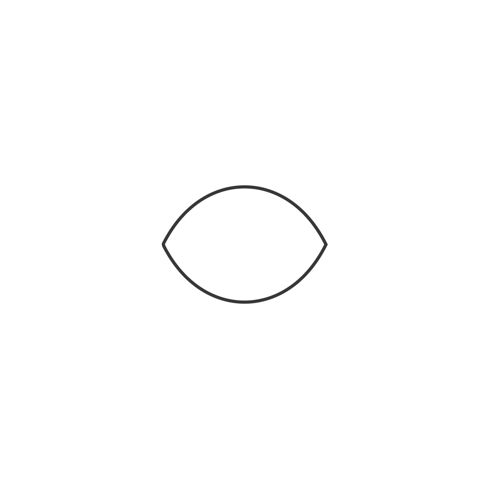
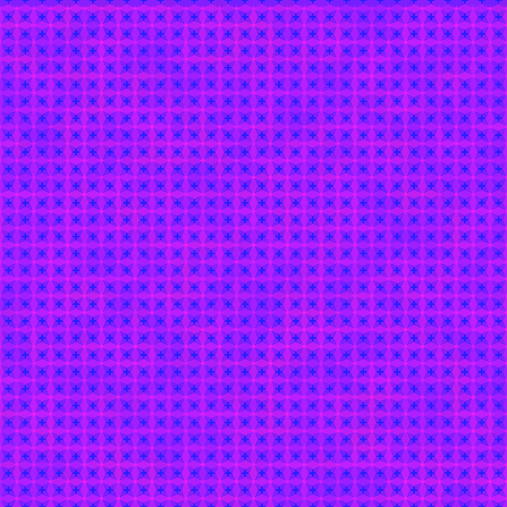
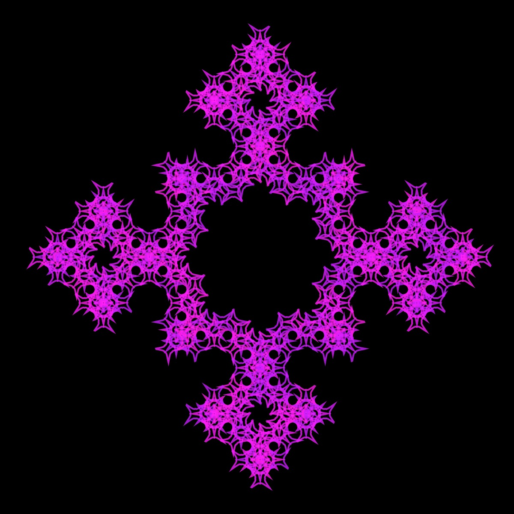
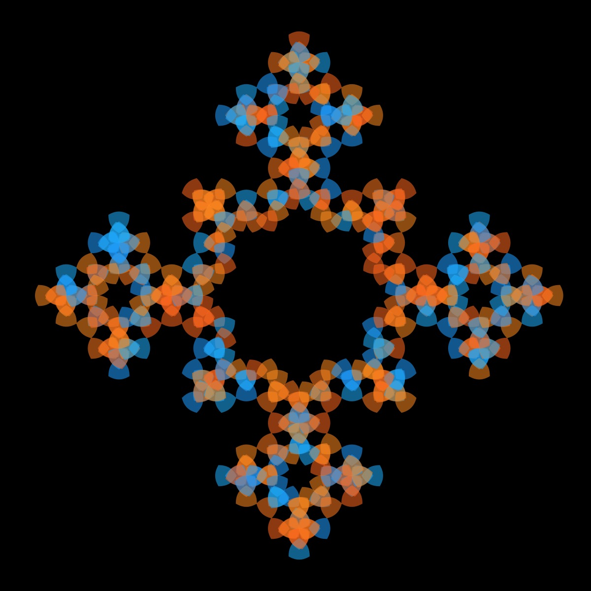

# Supershape

These images were all created with the supershape, which is the most versatile of the curves. It also has the most parameters. Here are some basic rules of thumb on how to change to parameters to yield different shapes.

m determines the number of sides
m = 0 => circle
m = 4 => square
The parameters a (x direction) and b (y direction) scale the shape.
The parameters n1 (both x and y directions), n2 (y direction), and n3 (x direction) affect the curviture of the shape. A number < 1 leads to a concave shape (bowed-in), while a number > 1 leads to a convex shape (bowed-outward).

## 🌄 Changing the Supershape Parameters

<!-- IMAGE-LIST:START - Do not remove or modify this section -->
<!-- prettier-ignore-start -->
<!-- markdownlint-disable -->
<table>
  <tbody>
   <tr>
     <td align="center"><a href="">  <b> Supershape with m = 2</b></a></td>
     <td align="center"><a href="">  <b> Supershape with m = 8</b></a></td>
    </tr>
    <tr>
     <td align="center"><a href="">  <b> Supershape with m = 8, n1 =4</b></a></td>
     <td align="center"><a href="">  <b> Supershape with m = 8, a = 1.25, b = 1.05</b></a></td>
    </tr>
    
  
    
 </tbody>
</table>

<!-- markdownlint-restore -->
<!-- prettier-ignore-end -->

<!-- IMAGE-LIST:END -->

Note that the second row, the images were created with all most identical parameters--only the color changed. Due to the color variation in the palette in the first image, you can see the individual shapes, while in the second image they blend in and are almost indestinguishable. In the third row, the ADH231a ruleset was used, but the parameters were changed (and the shapes were filled in second image)yielding completely different patterns.

## 🌄 Gallery

<!-- IMAGE-LIST:START - Do not remove or modify this section -->
<!-- prettier-ignore-start -->
<!-- markdownlint-disable -->
<table>
  <tbody>
   <tr>
     <td align="center"><a href="">  <b> Krishna anklet with supershape curve</b></a></td>
     <td align="center"><a href="">  <b> Pentaplexity with supershape</b></a></td>
    </tr>
    <tr>
     <td align="center"><a href="">  <b> Hilbert curve with supershape</b></a></td>
     <td align="center"><a href="">  <b> Hilbert curve with supershape</b></a></td>
    </tr>
     <tr>
     <td align="center"><a href="">  <b> ADH231a ruleset with supershape, a=0.9, b=2.5, m=8, n1=n2=n3=1;</b></a></td>
     <td align="center"><a href="">  <b> ADH231a ruleset with supershape, a=b=n1=n2=n3=1, m = 3</b></a></td>
    </tr>
  
    
 </tbody>
</table>

<!-- markdownlint-restore -->
<!-- prettier-ignore-end -->

<!-- IMAGE-LIST:END -->
